# MetaSense: Few-Shot Adaptation to Untrained Conditions in Deep Mobile Sensing

Taesik Gong, Yeonsu Kim, Jinwoo Shin, and Sung-Ju Lee KAIST, Republic of Korea {taesik.gong,yeonsu.kim,jinwoos,profsj}@kaist.ac.kr

# ABSTRACT

Recent improvements in deep learning and hardware support offer a new breakthrough in mobile sensing; we could enjoy contextaware services and mobile healthcare on a mobile device powered by artificial intelligence. However, most related studies perform well only with a certain level of similarity between trained and target data distribution, while in practice, a specific user’s behaviors and device make sensor inputs different. Consequently, the performance of such applications might suffer in diverse user and device conditions as training deep models in such countless conditions is infeasible. To mitigate the issue, we propose MetaSense, an adaptive deep mobile sensing system utilizing only a few (e.g., one or two) data instances from the target user. MetaSense employs meta learning that learns how to adapt to the target user’s condition, by rehearsing multiple similar tasks generated from our unique task generation strategies in offline training. The trained model has the ability to rapidly adapt to the target user’s condition when a few data are available. Our evaluation with real-world traces of motion and audio sensors shows that MetaSense not only outperforms the state-of-the-art transfer learning by $1 8 \%$ and meta learning based approaches by $1 5 \%$ in terms of accuracy, but also requires significantly less adaptation time for the target user.

# CCS CONCEPTS

• Human-centered computing $\longrightarrow$ Ubiquitous and mobile computing systems and tools.

# KEYWORDS

Human activity recognition; Mobile sensing; Deep learning; Meta learning; Few-shot learning

# ACM Reference Format:

Taesik Gong, Yeonsu Kim, Jinwoo Shin, and Sung-Ju Lee. 2019. MetaSense: Few-Shot Adaptation to Untrained Conditions in Deep Mobile Sensing. In The 17th ACM Conference on Embedded Networked Sensor Systems (SenSys ’19), November 10–13, 2019, New York, NY, USA. ACM, New York, NY, USA, 14 pages. https://doi.org/10.1145/3356250.3360020

# 1 INTRODUCTION

With it being more than a decade since the advent of smartphones, smart devices (smartphones and wearables) have enriched our lives via their ever-improving computing resources and sensing capabilities. Empowered by deep learning and mobile AI processors, mobile sensing has been developed for diverse applications, which were impossible just a few years ago. Recent examples include human activity recognition [26, 33, 34], acoustic context recognition [18, 19], complex physical exercise recognition [44], device-free authentication [3, 54], sign language recognition [5], and even predicting one’s emotional status [20, 22], to name a few. These mobile sensing applications have the potential of mainstream adoption as users could enjoy software-based services at any time without requiring extra hardware.

While these studies have opened the possibility of novel sensing applications with smart devices, they face performance challenges when deployed in the wild. Performance degradation is mainly caused by the existence of a vast number of individual conditions; we define an individual condition as a combination of multiple dependencies (e.g., the user’s behavior and device) that occur when deployed to a user, which is usually different from the condition where the sensing model was trained. Taking human activity recognition (HAR) with smartphones as an example; users would have their own patterns of activities (e.g., walking speed and stride) which in turn generate dissimilar sensor values across users. Moreover, users hold smartphones in various ways, e.g., in a pocket or on a hand that affects the orientation and position of the sensors. In addition, individuals have different smartphones that have heterogeneous sensor readings due to the diversity of both software and hardware specifications. Each of these dependencies, and the countless combination of these dependencies, is known to significantly degrade the performance of mobile sensing systems when deployed in practice [45, 47, 51]. These differences in individual conditions hinder mobile sensing systems from operating well for unseen users and thus overcoming this issue has become an important research question.

A naïve solution to this problem is to build an individual model by manually and sufficiently collecting the individual data. In modern deep neural networks however, it requires a massive amount of data, often over thousands, to train a large number of parameters while avoiding overfitting to the training data [11, 17, 46]. That is, it requires expensive cost and user effort in tedious data collection and labeling process, which is impractical. An alternative solution is to calibrate sensors or calculate condition-independent features to minimize the dependencies [8–10, 36, 38, 40, 41, 47, 52]. For instance, using the sum of the squared values of each x, y, and zaxis accelerometer values helps mitigate the dependency for activity recognition with smartphones [40, 41]. However, this line of work typically focuses only on a certain part of dependencies (e.g., sensor orientation). More importantly, these approaches require expertise that is tailored to a specific sensor types and applications. Therefore, they could not apply the same method as the type of sensors (e.g., from motions to audio) and sensing applications (e.g., from activity to emotion recognition) change. Motivated by these challenges, we attempt to answer the following question: is there a general solution that overcomes the individual condition in mobile sensing with minimal user effort?

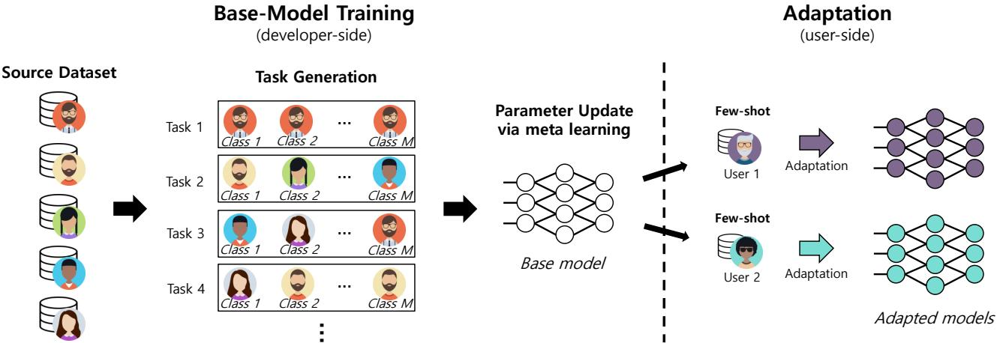  
Figure 1: MetaSense overview.

We present MetaSense, a system that adapts deep sensing models to a target user with a few shots from the target (one shot is one labeled sample per class). Figure 1 is an overview of MetaSense. MetaSense trains a base model by providing multiple ‘episodic’ tasks via our task generation strategies, where each task refers to adapting to an individual condition. With each task, the base model experiences various individual conditions and make its parameters adaptive to a new/unseen condition. When the base model is deployed to a user, it adapts to the target user’s condition with only a few shots (e.g., one or two). Since MetaSense works with only a few shots, it significantly diminishes the laborious data collection process for each user while still achieving desirable performance. MetaSense is applicable to any deep learning models (i.e., modelagnostic) and does not limit its coverage to specific type of sensors or applications (i.e., condition-agnostic). MetaSense also entails significantly less adaptation time compared to the traditional deep neural networks training, which is undoubtedly beneficial to the resource-constrained mobile devices.

To enable such a few-shot adaptation system, we employ the idea of few-shot learning, enabled by meta learning [7, 15, 37, 43]. Meta learning (also known as “learning to learn”) is an attempt to imitate the human’s ability that adapts quickly and efficiently to new concepts. As an analogy, one can easily learn how to ride an ice skate if she already knows how to ride a roller skate. Bringing this concept to machine learning, meta learning aims to build a model that rapidly adapts to a new condition that has never been encountered during the training. Our intuition of utilizing meta learning is that deep mobile sensing systems could typically be deployed to many unknown conditions, and this challenge could be handled by learning how to adapt to unknown conditions.

To our best knowledge, MetaSense is the first to propose the use of meta learning as a solution to the individual condition problem in deep mobile sensing. Most existing meta learning approaches are limited to demonstrating their performance with a large corpus of image data (e.g., Omniglot [29]). In mobile sensing, however, the scarce dataset and the aforementioned countless combinations of dependencies make the situation different and hence requires a unique and sophisticated solution in the way of applying meta learning. Beyond just adopting a meta learning solution to mobile sensing, we propose three task generation strategies to effectively leverage available data and enhance the objective of meta learning. Due to this, the proposed scheme outperforms other few-shot learning baselines (§4.3).

In particular, to evaluate MetaSense, we collected datasets of two tasks: human activity recognition (via motion sensors) and speech recognition (via microphones), under the combination of multiple dependencies (e.g., user, device model and type, sensor position and orientation dependencies). We compare MetaSense to six different baseline methods including the state-of-the-art transfer learning [32] and few-shot learning algorithms [7, 43]. Our results indicate that MetaSense outperforms the baselines in both accuracy and training overhead. In our activity recognition dataset for instance, MetaSense improves the accuracy of the non-adapted model from $2 7 . 6 \%$ to $6 7 . 2 \%$ with only one shot. Compared to transfer learning, MetaSense achieves accuracy improvement of $1 8 \%$ on average, with only one fourth of its adaptation time. In addition, our task generation strategies tailored to the mobile condition problem outperform the accuracy of existing few-shot learning approaches by $1 5 \%$ on average. We also evaluate MetaSense with two public datasets and the results demonstrate that the effectiveness and efficiency of MetaSense can be generalized.

We summarize our key contributions as follows:

• We present MetaSense, a few-shot adaptation system for deep mobile sensing using meta learning. We believe MetaSense is the first proposal to reveal that meta learning is a promising solution to overcome the multi-dependency challenge in deep mobile sensing. Our key intuition behind adopting meta learning is by rehearsing condition changes while training,

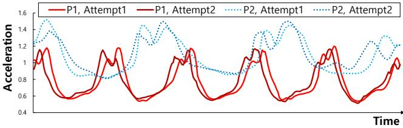  
(a) Magnitude of acceleration from the activity “jumping”.

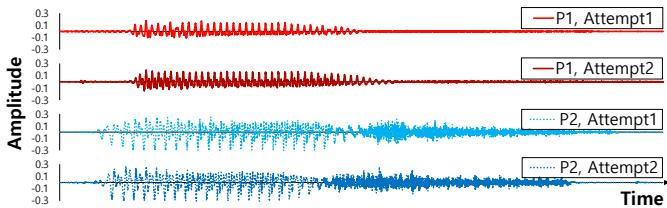  
(b) Audio waves from the word “yes”.   
Figure 2: Comparison of raw signals between and within users P1 and P2. Attempt 1 and 2 are specified for each user.

the model is trained in a way that it learns how to adapt to new conditions.   
• We propose three task generation strategies to effectively leverage a limited number of mobile sensing data for boosting the performance of meta learning in mobile sensing, which leads to the superior performance over other few-shot learning baselines.   
• Our experimental result with six baselines demonstrates that MetaSense outperforms the state-of-the-art transfer learning by $1 8 \%$ on average and few-shot learning methods by $1 5 \%$ on average with respect to accuracy. Additionally, MetaSense requires significantly less adaptation time compared to traditional deep learning approaches. Our evaluation with four different datasets, three different models, and a different number of available data validates the MetaSense’s performance under various circumstances.

# 2 BACKGROUND AND MOTIVATION

We motivate why models should adapt to individual conditions in mobile sensing. We investigate what are the factors that degrade in the-wild performance of mobile sensing applications and quantify the problem through two case studies; human activity recognition and speech recognition.

# 2.1 Why Conditions Matter

While recent studies have shown the potential of a variety of mobile sensing applications powered by deep learning [3, 5, 18– 20, 22, 26, 33, 34, 44, 54], they must overcome the challenge of diverse individual conditions for wider adoption. Mobile sensing applications get input from the sensors in smart devices for their services, e.g., Inertial Measurement Unit (IMU) for motions and microphone for audio. The sensed values, however, are highly dependent on various conditions which in turn deteriorate the performance when faced with an untrained condition. We summarize the following two major categories where the individual conditions come from.

User dependency: Humans have different physical conditions and behaviors that make them unique between each other. In human activity recognition (HAR) for instance, users have dissimilar patterns of “walking” in term of the speed and stride, which could be confused with someone’s “running”. In addition, some people prefer to put their phone in their pocket, while others hold in hand, and each smartphone position makes different sensor readings even with the same device. Since users’ behaviors are unbounded and cannot be easily characterized in advance, user dependency is one of the major obstacles for mobile sensing to overcome.

Device dependency: Users have their own devices that have a different shape, weight, sensor specification, and so on, which make the model get different sensor values. Especially for IMU sensors, different devices have different sensor biases, errors, and sampling rates [45]. In addition, software heterogeneity (e.g., different versions of OS) makes sensor readings different [21]. With the recent spread of wearable devices, some users might run the sensing application in their wearable devices instead of smartphones. As the number of unique Android devices has already exceeded over 24,000 in 2015 [23], it seems infeasible to collect data from all possible devices in advance to train and make the model work effectively for every device.

Previous studies have shown that the user and device depen dencies degrade the performance of mobile sensing [45, 51]. While there have been attempts to resolve the dependencies, most focus on isolated dependencies, e.g., user dependency [16, 35, 39, 40, 42], device position/orientation [10, 49, 52], and hardware/software heterogeneity [21, 36]. However, mobile sensing when deployed in practice, typically faces all of the dependencies. Considering the countless possible combinations of users and devices in the real world, building a well-performing model for all different conditions seems to an impractical, if not impossible, proposal.

# 2.2 Case Study: Activity & Speech Recognition

To understand how the individual condition affects deep mobile sensing performance, we collected two datasets, i.e., activity and speech recognition with ten different users (P1–P10) and devices (seven smartphones and three smartwatches). Activity recognition has nine activities and speech recognition has 14 keywords. Note that there are no duplicate devices or users, and data collection is performed without specific restrictions to allow and encourage different behaviors of users. The resulting dataset contains ten individual conditions from ten users. The details of the dataset and preprocessing are described in $\ S 4 . 1 . 1$ .

Figure 2 compares the raw signal within and between users P1 and P2. Figure 2a illustrates the square root of the squared sum of x, y, and $\mathbf { Z }$ -axis accelerations for the “jumping” activity of users P1 and P2. We specify two different instances of the jumping activity as Attempt1 and Attempt2 in order to compare within-condition variability to cross-conditions variability. Similarly, Figure 2b shows the raw audio waves from the keyword “yes”. The top two graphs show two different instances of P1 while the bottom two graphs show those of P2. As shown in both figures, while two different attempts from the same user appear similar, different conditions make significantly different sensor readings even for the same class (i.e., “jumping” and “yes”).

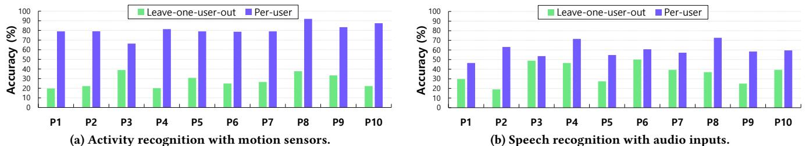  
Figure 3: Per-user accuracy of activity recognition and speech recognition. Leave-one-user-out and per-user models are com pared.

To further investigate how the different sensor readings affect the performance for deep sensing models, we trained convolutional neural networks (CNN) based models for each dataset (details in $\ S 4 . 1 . 3 )$ . We trained the model in two ways: a leave-one-user-out model and a per-user model. The leave-one-user-out model represents a common development scenario where a developer collects data from multiple conditions and train the model with the dataset, and test the model with a real user. Meanwhile, the per-user model is trained only on the data collected from the target user’s condition. For P1 for instance, the leave-one-user-out model is trained on P2– P10’s data while the per-user model is trained on P1’s training data, and both are evaluated on the test data of P1. When training the model, we use $L _ { 2 }$ -regularization and batch normalization to avoid possible overfitting and report the accuracy with the test dataset.

Figure 3 shows the accuracy for activity recognition and speech recognition of our models trained with leave-one-user-out and peruser manner, respectively. For our activity recognition dataset (Figure 3a), even though leave-one-condition-out models utilized about nine times more training data, they show significantly worse performance than the per-user models. This suggests the combination of multiple dependencies makes the model difficult to generalize its performance to unseen conditions. Figure 3b shows that a similar trend exists for our speech recognition data. The performance gap between the leave-one-user-out and per-user models decreases in the speech recognition dataset, possibly because the task of saying a word at different conditions is more similar than performing an activity. Still, both results show adapting the sensing models to unseen conditions is important.

# 3 METASENSE

We present MetaSense by starting with an overview and the meta learning scheme MetaSense uses (§3.1). We then detail our task generation algorithms to catalyze the effect of meta learning (§3.2), followed by the parameter update algorithm that makes the model adaptive to untrained conditions (§3.3). With the generated model, we explain how MetaSense can adapt rapidly to a new/unseen user with a few labeled data (§3.4).

# 3.1 Overview: Meta Learned Adaptation

We consider a practical scenario where a model developer has a source dataset collected under several individual conditions, e.g., activity recognition data from multiple users measured with their own devices. Under the scenario, the goal of MetaSense is to adapt to a new/unseen user’s condition when only a few target user’s data samples are available. We denote a labeled data instance for each class as a shot. Note that we assume a few shots (e.g., one or two) are given from the target user and the original source dataset does not contain any data samples from the target user. Namely, a model developer first trains a base model with the source dataset, and the model further adapts to the target user’s conditions using very small gradient steps of a few labeled data samples.

To handle adaptation with only a few shots, we design a meta learning framework, also known as learning to learn, to train the model. Meta learning [7, 15, 37, 43] generally aims to learn a new task or environment rapidly, by learning how to learn. Our intuition behind using meta learning is that deep mobile sensing systems could be deployed to countless unknown individual conditions, which could be resolved by learning how to adapt to unknown conditions. Hence, the meta-objective of MetaSense is learning effective parameters that has an ability to adapt to an unseen condition.

Figure 1 shows an overview of MetaSense. MetaSense trains the deep sensing model through two steps, i.e., base-model training and adaptation. Specifically, MetaSense makes the base model learn how to adapt to a new condition with only a few shots and gradient steps. The base model is trained on a set of tasks, where each task is generated from the source dataset. Individual task mimics a situation where the model performs under a new untrained condition. After training, the base model has the knowledge of how to adapt to a new condition with a few shots. In the adaptation step, a target user provides a few shots to the model and the model adapts its parameters with a small number of gradient steps (e.g., 10). After the adaptation process, the model is ready for the target user’s conditions.

Algorithm 1 MetaSense Base-Model Training   

<table><tr><td>Input: Source dataset D = {(x1,y1),..,(xn,yn)}, learning rate hyperparameters a,</td></tr><tr><td>Output: Trained parameters 0</td></tr><tr><td>1: 0  random initialization 2: while not finished do.</td></tr><tr><td>3: T  GENERATETASK(D) &gt; Details in $3.2</td></tr><tr><td>4: for Ti e T do</td></tr><tr><td>5: S,  K support samples from Ti</td></tr><tr><td>6: QT,  K query samples from Ti where S,  Q, = 0</td></tr><tr><td>7: Evaluate V L;(fe) with St, via Equation (2)</td></tr><tr><td>8: 0&#x27; =0-aVgLT;(fe) &gt; Get Ti-specific parameters</td></tr><tr><td>9: Evaluate Lg(fe) with QTi</td></tr><tr><td>10: &gt; Update 0 00-BVoT(fo1)</td></tr></table>

Algorithm 1 outlines our base-model training method, where we provide further details in $\ S 3 . 2$ and $\ S 3 . 3$ . We refer to $\mathcal { D } = \{ ( \pmb { x } _ { 1 } , \pmb { y } _ { 1 } )$ $\scriptstyle \dots , ( { \pmb x } _ { N } , { \pmb y } _ { N } ) \}$ as the source dataset, $x _ { i }$ is an input vector, and ${ \pmb y } _ { i }$ is ..., x N ,yNa one-hot label vector where $\pmb { y } _ { i } \in \mathcal { Y }$ , $_ y$ yiis the set of all labels, and $| y | = M$ i. The source dataset has been collected from multiple conditions. Base-model training algorithm outputs trained parameters $\theta$ for a deep sensing model $f _ { \boldsymbol { \theta } } ( { \pmb x } )$ . With $\mathcal { D }$ , MetaSense generates a θset of tasks $\mathcal { T }$ fθ xthat are designed to boost the effect of meta-learning objective, e.g., learning to adapt to the target condition (line 3). We explain the details of task generation in $\ S 3 . 2$ . From each generated $\mathcal { T } _ { i } \in \mathcal { T }$ , MetaSense samples a support set and a query set without overlap between them (line 5–6). For each task, MetaSense computes temporal parameters $\theta _ { \mathcal { T } _ { i } } ^ { \prime }$ via gradient descent with the support set and evaluates the loss function $\mathcal { L } _ { \mathcal { T } _ { i } }$ with the temporal parameters and the query set (line 7–9). The final parameters are updated by a meta objective, which minimizes the sum of each task-specific loss (line 10). We detail this parameter update process in $\ S 3 . 3$ . Through this meta learning process, the trained parameters learn an effective way to adapt to the unseen task, i.e., the target condition.

# 3.2 Task Generation

Unlike existing meta learning methods where tasks are randomly generated by sampling from a large available dataset, how to efficiently and effectively leverage the limited source dataset is the unique challenge in applying meta learning to data-hungry mobile sensing. We view each task as each individual condition in mobile sensing. Thus, the goal of our task generation is to generate diverse and realistic individual conditions given the source dataset so that MetaSense can teach the base model how to adapt to possible condition changes via various tasks.

MetaSense generates a set of tasks $\mathcal { T }$ from $\mathcal { D }$ . Each task $\mathcal { T } _ { i } \in \mathcal { T }$ has a set of data samples, $\{ ( \pmb { x } _ { 1 } , \pmb { y } _ { 1 } ) , . . . , ( \pmb { x } _ { N _ { \mathcal { T } _ { i } } } , \pmb { y } _ { N _ { \mathcal { T } _ { i } } } ) \}$ i. We assume the model developer has a source dataset $\mathcal { D }$ Nfrom $C$ individual conditions (e.g., user and device pairs). We let a subset of dataset $\mathcal { D } _ { c } \subset \mathcal { D }$ , an individual condition dataset $\left( I C D \right)$ that represents a dataset from a specific condition such that

$$
\bigcup _ { c = 1 } ^ { C } \mathcal { D } _ { c } = \mathcal { D } \mathrm { ~ a n d ~ } \mathcal { D } _ { c } \cap \mathcal { D } _ { d } = \emptyset ,
$$

where $\cup$ is the set of all elements in the collection, $c \neq d$ , and $1 \leq$ $c , d \leq C$ . We devise three strategies of generating tasks to maximize the effect of meta learning for few-shot adaptation to individual conditions as follows.

Per-condition tasks: To mimic a situation where the base model meets an unseen target condition when deployed to the target user, we generate each per-condition task from a sampled data by each ICD. Specifically, we generate $\mathcal { T } _ { i }$ where $\mathcal { T } _ { i } \subset \mathcal { D } _ { c = i }$ for all $1 \leq i \leq C$ as illustrated in Figure 4. With these tasks, the base model experiences adapting to real individual conditions. As the number of per-condition tasks is equal to the number of collected conditions $C$ , the number of conditions the model developer has affects the performance of base model training. We found that the more conditions the base model is trained on, the better the performance. This is because the base model has more opportunities in advance to experience diverse conditions before being deployed to the target user. We evaluate the impact of the number of available conditions in $\ S 4 . 5$ .

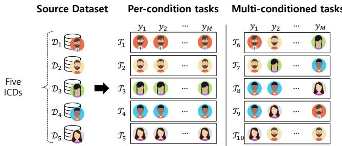  
Figure 4: An illustration of per-condition tasks and multiconditioned tasks generated from five individual conditioned datasets (ICDs).

Multi-conditioned tasks: We generate multi-conditioned tasks in addition to per-condition tasks. A multi-conditioned task is made of samples from randomly selected ICDs. Our intuition for generating multi-conditioned tasks is to intentionally provide the base model with artificial conditions so that it can be (i) trained on more diverse tasks beyond per-conditions tasks while (ii) avoiding possible overfitting to the per-conditions tasks. We generate $C$ number of multi-conditioned tasks for each iteration of training in order to take advantage of the randomness for generalization. Specifically, for each class label $\pmb { y } _ { j } \in \mathcal { Y }$ , we randomly choose an ICD $\mathcal { D } _ { c }$ and j csample data from the dataset for the label as illustrated in Figure 4. That means for all $( { \pmb x } _ { i } , { \pmb y } _ { i } )$ in a multi-conditioned task if ${ \pmb y } _ { i } = { \pmb y } _ { j }$ then $( { \pmb x } _ { i } , { \pmb y } _ { i } ) \in \mathcal { D } _ { c }$ i i j. Each multi-conditioned task is thus generated i ifrom at most $\left| y \right| = M$ ICDs. This way, we can generate more realistic tasks compared to entirely random sampling from $\mathcal { D }$ , as it keeps input distribution within each class.

Homogeneous task generation: We generate the above tasks with keeping labels consistent across tasks. This is contrary to existing meta learning approaches [7, 15, 37, 43] where the labels for each task are mixed randomly, i.e., $y _ { \mathcal { T } _ { i } } \neq y _ { \mathcal { T } _ { j } }$ where $\mathcal T _ { i } \not = \mathcal T _ { j }$ . Since the objective of most meta learning studies in machine learning is focused on adapting to arbitrary tasks that might not have the same labels, this label mixing strategy would be natural for them. On the other hand, in our problem, the source and the target datasets have different distribution but have the same label space, i.e., $y _ { \mathcal { T } _ { i } } = y _ { \mathcal { T } _ { j } }$ where $\mathcal T _ { i } \not = \mathcal T _ { j }$ . We found keeping labels consistent is effective as it i jleverages the common knowledge on the same label set $_ y$ across tasks.

Since the source dataset is collected from multiple conditions, it is common to have imbalanced numbers of data instances among $\mathcal { D } _ { c }$ . When generating per-condition and multi-conditioned tasks, we sample a batch of data uniformly across conditions (i.e., giving the same weight to all conditions and accordingly the generated tasks) in order to avoid being biased to some conditions that have a higher number of samples than others.

The generated task set $\mathcal { T }$ via the above three strategies has $2 C$ Ctasks. The base model iterates each task to update the parameters as explained next. We evaluate the effectiveness of our unique task generation strategies in $\ S 4 . 3$ .

# 3.3 Parameter Updates

With the generated tasks in $\ S 3 . 2$ , we train the parameters of the base model via meta learning. Specifically, MetaSense employs model-agnostic meta learning (MAML) [7] for updating the parameters. MAML is applicable to any deep neural networks that use gradient descent (model-agnostic) and requires only a few gradient steps to update the model. The assumption of MAML is that there exist initial parameters that are transferable to a new task with only a few shots. MAML trains the initial parameters in a way that the trained parameters are adaptive to change of tasks. Our intuition behind adopting MAML is that for deep sensing models there exist effective initial parameters that are transferable between individual conditions, so that the parameters can be adapted to the target condition within a few gradient steps.

From each task $\mathcal { T } _ { i }$ , MetaSense samples a support set $S _ { \mathcal { T } _ { i } }$ and a query set $Q \tau _ { i }$ ithat have $K$ shots, respectively. $K$ should be a small number (e.g., 5) to simulate a few shots from a target user. Support sets are used for training the task-specific parameters $\theta _ { \mathcal { T } _ { i } } ^ { \prime }$ , which simulates adapting parameters to a target condition. Query sets are used for evaluating the task-specific parameters and eventually updating the parameters $\theta$ of our interest (i.e., the base model). We ensure support sets and query sets have no overlapping data. We target a multi-class classification problem and use cross-entropy loss to evaluate the per-task loss, i.e.,

$$
\mathcal { L } _ { \mathcal { T } _ { i } } ( f _ { \theta } ) = \sum _ { ( \boldsymbol { x } _ { j } , \boldsymbol { y } _ { j } ) \in S _ { \mathcal { T } _ { i } } } \boldsymbol { y } _ { j } \log f _ { \theta } ( \boldsymbol { x } _ { j } ) + ( 1 - \boldsymbol { y } _ { j } ) \log f _ { \theta } ( 1 - \boldsymbol { x } _ { j } ) .
$$

We then get $\mathcal { T } _ { i }$ -specific parameters $\theta _ { \mathcal { T } _ { i } } ^ { \prime }$ with a few gradient descent steps (e.g., 5 steps):

$$
\begin{array} { r } { \theta _ { \mathcal { T } _ { i } } ^ { \prime } = \theta - \alpha \nabla _ { \theta } \mathcal { L } _ { \mathcal { T } _ { i } } ( f _ { \theta } ) , } \end{array}
$$

where the task learning rate $\alpha$ is a hyperparameter: it is usually set as a higher number (e.g., 0.1) than traditional learning rate to enforce fast adaptation [7].

With the task-specific parameters, we define a meta-objective function as follows:

$$
\underset { \theta } { \arg \operatorname* { m i n } } \sum _ { \mathcal { T } _ { i } } \mathcal { L } _ { \mathcal { T } _ { i } } ( f _ { \theta _ { \mathcal { T } _ { i } } ^ { \prime } } ) \quad \mathrm { w h e r e } \ \theta _ { \mathcal { T } _ { i } } ^ { \prime } = \theta - \alpha \nabla _ { \theta } \mathcal { L } _ { \mathcal { T } _ { i } } ( f _ { \theta } ) .
$$

The meta-objective is finding parameters $\theta$ that minimize the sum of task losses. Note that each task loss $\mathcal { L } _ { \mathcal { T } _ { i } }$ is evaluated by the taskspecific parameters $\theta _ { \mathcal { T } _ { i } } ^ { \prime }$ that are calculated by a few gradient descent steps with a query set that has a few shots (Eq. (3)). This enforces $\theta$ to be sensitive to task changes so that it becomes effective within a few gradient steps. Note that the tasks generated by MetaSense reflect individual conditions. The meta-objective is thus interpreted as minimizing the sum of task-specific losses, so that the optimal parameters of $\theta$ become an effective initialization of the model such that with the parameters the model can rapidly adapt to a new condition after several gradient steps with a few shots.

The last step is updating the parameters $\theta$ by minimizing the meta objective with stochastic gradient descent (SGD):

$$
\theta \gets \theta - \beta \nabla _ { \theta } \sum _ { \mathcal { T } _ { i } } \mathcal { L } _ { \mathcal { T } _ { i } } ( f _ { \theta _ { \mathcal { T } _ { i } } ^ { \prime } } ) ,
$$

where the meta learning rate $\beta$ is a hyperparameter. Note that the trained base model $f _ { \theta }$ has initial parameters $\theta _ { 0 } = \theta$ that are expeθrienced through meta learning with multiple tasks that simulate encountering unseen conditions in the real world. The base model is now prepared for adaptation with a few shots from a target user.

# 3.4 Adaptation

After the base-model training is performed by the developer, the base model could be deployed to any real users. The base model is adapted for the target user with a few shots (e.g., 1 or 2 samples per class) once at the beginning of the sensing application. We denote ${ \mathcal { U } } = \{ ( { \boldsymbol { x } } _ { 1 } , { \boldsymbol { y } } _ { 1 } ) , . . . , ( { \boldsymbol { x } } _ { L } , { \boldsymbol { y } } _ { L } ) \}$ as the target user’s dataset that has $\begin{array} { l } { { \frac { L } { M } } } \end{array}$ L L Mshots. Since there are almost infinite individual conditions in the wild, we assume a practical scenario where the target user’s dataset has no identical conditions to the source dataset that the base model is trained on, i.e., $\mathcal { D } \cap \mathcal { U } = \emptyset$ .

Let the base model be $f _ { \theta _ { 0 } }$ , where $\theta _ { 0 }$ is the initial parameters that θare trained through meta learning. After $i$ gradient descent steps with the few shots, the parameters become:

$$
\theta _ { i } = \theta _ { i - 1 } - \alpha \nabla _ { \theta } \mathcal { L } _ { \mathcal { U } } ( f _ { \theta _ { i - 1 } } ) .
$$

Note that since the base model experienced a set of tasks through Eq. (2)–(5), the trained parameters can effectively adapt to the target condition with the meta-learned knowledge. While requiring only a few shots from the target user, another advantage of this parameter update algorithm is that it takes only a few gradients steps, which significantly reduces the training time on the resource-constraint mobile devices. We evaluate the time taken to adapt the model compared to other deep neural networks baselines in $\ S 4 . 4 .$ .

# 4 EXPERIMENTS

We evaluate MetaSense in various aspects to analyze its performance. Specifically, we try to answer the following questions through our evaluation: (i) How well does MetaSense perform against existing approaches? (ii) How effective are MetaSense’s task generation strategies? (iii) How rapidly can MetaSense adapt to the target? (iv) What is the impact of the amount of source data and model architectures for MetaSense? (v) How well does MetaSense perform on different datasets?

# 4.1 Settings

4.1.1 Dataset. We detail the data collection and preprocessing of our datasets. The goal of our data collection is to evaluate MetaSense with real-world datasets collected under individual conditions. Specifically, we collected two most widely used types of sensors, IMU and audio. We recruited ten users (aged 21-29; mean 24.6, and three females) and conducted IRB-approved data collection experiments. Each user performed activity recognition (for IMU) and speech recognition (of audio) tasks. We randomly distributed ten different Android devices (seven smartphones and three smartwatches) for each user as listed in Table 1. In the table we specify the device name, the type (smartphone or smartwatch), the maximum IMU sampling rate, and the Android OS version. We believe this dataset is the first dataset collected under individual conditions from two common sensors (IMU and audio).

Table 1: Settings for our data collection.   

<table><tr><td>User</td><td>Device</td><td>Type</td><td>IMU rate</td><td>os</td></tr><tr><td>P1</td><td>Samsung Galaxy J7</td><td>Phone</td><td>100Hz</td><td>7.0.0</td></tr><tr><td>P2</td><td>Google Nexus5</td><td>Phone</td><td>200Hz</td><td>6.0.1</td></tr><tr><td>P3</td><td>Essential Phone</td><td>Phone</td><td>400Hz</td><td>7.1.1</td></tr><tr><td>P4</td><td>Google Pixel2</td><td>Phone</td><td>400Hz</td><td>8.1.0</td></tr><tr><td>P5</td><td>HUAWEI P20</td><td>Phone</td><td>500Hz</td><td>8.1.0</td></tr><tr><td>P6</td><td>Samsung Galaxy S9</td><td>Phone</td><td>500Hz</td><td>8.0.0</td></tr><tr><td>P7</td><td>LG G5</td><td>Phone</td><td>200Hz</td><td>6.0.1</td></tr><tr><td>P8</td><td>LG Urbane</td><td>Watch</td><td>200Hz</td><td>Wear 2.23.0</td></tr><tr><td>P9</td><td>LG G Style</td><td>Watch</td><td>100Hz</td><td>Wear 2.6</td></tr><tr><td>P10</td><td>ASUS Zenwatch3</td><td>Watch</td><td>100Hz</td><td>Wear 2.23.0</td></tr></table>

Our activity recognition task is composed of nine activities that are commonly used in the literature [2, 45]. Specifically, they are “walking”, “running”, “stair down”, “stair up”, “lying”, “standing”, “stretching”, “sitting”, and “jumping”. Participants performed each task for around 2–5 minutes with the duration varying based on the intensity of the activity. Note that we let the participants hold their device freely (e.g., in the pocket, on hand, or on wrist) for each activity to assure conditions are individual and natural. We did not give explicit guidelines to the activities, so that participants performed the activities according to their personal interpretation. This naturally yields different styles of activities among users. We recorded each x, y, and $\mathbf { Z }$ -axis of accelerometer and gyroscope values at the maximum sampling rate. We divide the data with 256-length window and use it to train the model. However, since devices have different sampling rates, this fixed-sized window maps different durations (0.5–2.5 seconds) for different devices. We also evaluate a down-sampled version $( 1 0 0 \mathrm { H z } )$ in $\ S 4 . 2$ .

The second task is speech recognition. We chose 14 words considering IoT applications [50]: “yes”, “no”, “up”, “down”, “left”, “right”, “on”, “off”, “stop”, “go”, “forward”, “backward”, “follow”, and “learn” were used. Each participant holds the device in their preferred fashion and uttered each word 30 times in an office room. We did not control their behaviors so that they had different individual conditions, such as speech loudness, speed, and the distance between the device and the user, etc. We recorded each utterance of a word for 2 seconds with $1 6 \mathrm { k H z }$ sampling rate so as to exclude unnecessary spectrum range for human voices.

4.1.2 Baselines. We compare MetaSense to six baselines, which are widely used approaches for handling various untrained conditions: traditional DNNs, the state-of-the-art transfer learning and few-shot learning approaches. We not only aim to compare the performance of MetaSense to these baselines, but also inspect how these baselines perform under condition changes. Specifically, we have the following baselines.

Src: For Src (source only), we use only the source dataset for training the deep neural network and there is no adaptation to the target user. Src is the same as the leave-one-user-out model in $\ S 2 . 2$ . Src is a widely used method in resolving the diversity of inputs, i.e., training on as many data as possible that are collected from diverse conditions. The performance of Src shows how well the condition problem in mobile sensing could be resolved by using the source dataset collected from other conditions. All the other baselines we consider utilize the target users’ data to adapt the model.

Tgt: Tgt (target only) trains the model with only the few shots from the target user. Tgt is the same as the per-user model in $\ S 2 . 2$ .

Src+Tgt: Src+Tgt (source plus target) uses both the source dataset and the target users’ few shots for training the deep neural network. Compared to Src, this baseline leverages the target user’s data for adaptation while utilizing a relatively large amount of source data to learn general representations.

TrC: Transfer Convolutional (TrC) [32] is the state-of-the-art transfer learning in adapting to a target user’s activity recognition with motion sensors with a few data samples. Specifically, TrC first trains the model with the source dataset. When TrC adapts the model, it freezes the CNN layers’ parameter and fine-tunes only the following fully connected layers with a few shots. The assumption underlying this approach is that upper layers’ representations are more transferable between similar problems [24, 32, 48]. Our meta learning scheme is more powerful in the sense that it learns how to transfer among similar tasks without this assumption.

PN: Prototypical Network (PN) [43] is one of the state-of-the-art few-shot learning algorithms based on meta learning. Given a few training data, PN generates prototypes in embedding space and each prototype is the representative of each class. In inference, PN uses the Euclidean distance metric to classify the closest prototype (i.e., class).

MAML: Another popular few-shot learning baseline is MAML [7], which is adopted in our parameter update stage $\ S 3 . 3$ . The performance difference between PN and MAML would indicate which method is more effective in deep mobile sensing, while the comparison between the original MAML and MetaSense would highlight the impact of our task generation strategies.

4.1.3 Implementation. To ensure a fair evaluation, we use the same model architecture and hyperparameters, e.g., learning rates, for all DNN-based baselines and MetaSense. We design them with convolutional neural networks (CNN) followed by fully-connected layers. CNN is a widely used architecture not only in vision but also in activity and speech recognition with mobile sensors [12, 13, 32]. Specifically, the model architecture is composed of five convolutional layers, followed by three fully-connected layers. We use Rectified Linear Unit (ReLU) for activation function. We investigate the impact of different model sizes in $\ S 4 . 6$ . We use two regularization techniques, i.e., $L _ { 2 }$ -regularization and batch normalization to prevent overfitting. We train the model with Adam optimizer [14]. We use five gradient descent steps for training the base model (Eq. (2)) with $K = 5$ and ten steps for adaptation (Eq. (6)). We implement MetaSense using the PyTorch framework [25] and train the model in a server equipped with eight NVIDIA TITAN Xp GPUs and 256 GB memory with Intel Xeon E5-2697 2.30 GHz processors.

# 4.2 Accuracy

We train the base model in a leave-one-user-out manner. Specifically, we use the others’ data as the source dataset for each target user. Namely, there are ten evaluations in total, and for each user we have a source dataset with nine ICDs of the other users. We report the average accuracy for the untrained/target user among the ten scenarios. We focus on 1, 2, 5, and 10-shot cases that are frequently used in few-shot learning evaluations [7, 37, 43]. We use early stopping on the validation set and evaluate the accuracy onactivity_dc the test set.

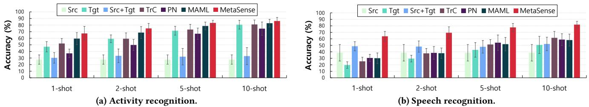  
Figure 5: Average accuracy with 1, 2, 5, and 10-shots.

4.2.1 Superiority of MetaSense over Baselines. Figure 5 reports the accuracy of the baselines and MetaSense for activity recognition (Figure 5a) and speech recognition (Figure 5b). The error bar is standard deviation (stdev for short) across users and thus high stdev indicates the method has high variance among users, i.e., low stdev suggests the method shows stable performance across users.

In general, as the number of shots increases, the accuracy also increases except for Src as Src does not use the target data. In most cases, Tgt performs better than Src, which means the learned representations from multiple other conditions would not generalize to a new condition. This again highlights the importance of adaptation for deep mobile sensing. Tgt, however, does not achieve higher performance than MetaSense, in particular when the number of data is small due to overfitting. In all cases, MetaSense outperforms the baselines, which shows the effectiveness of our approach when dealing with new unseen/target conditions. In activity recognition, MetaSense improves the accuracy of Src from $2 7 . 6 \%$ to $6 7 . 2 \%$ with only one shot, where the improvement is $1 5 \%$ higher compared to TrC. Furthermore, MetaSense outperforms the few-shot learning baselines thanks to our task generation strategies, which we dissect in $\ S 4 . 3$ .

4.2.2 Activity Recognition vs. Speech Recognition. Interestingly, the baselines show different accuracy trends between two datasets; while Src and $\mathrm { S r c } { + } \mathrm { T g t }$ show the worst accuracy in activity recognition, they yield relatively high accuracy in speech recognition (especially in 1-shot and 2-shot cases). This is due to the degree of variability of individual conditions among users according to the target problem. Activity recognition involves more diverse individual conditions than speech recognition, as the activities could be performed significantly differently among users. Therefore, in speech recognition, Src and Src+Tgt perform better in 1-shot and 2-shot cases as the learned representations are more transferable to target users than in activity recognition. Still, the situation is reversed as the number of shots increased (5-shot and 10-shot), showing that when available target data is larger than a certain threshold, it is better to directly train with the data from the target condition for the baselines, due to the dissimilarity between the source and target conditions. In both datasets, MetaSense demonstrates its improvement over the baselines without being heavily biased to a certain dataset and without the issue of the number of shots as in the speech recognition dataset.

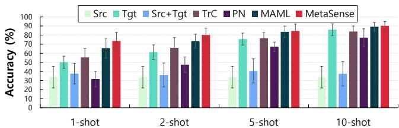  
Figure 6: Accuracy of the down-sampled activity recognition dataset.

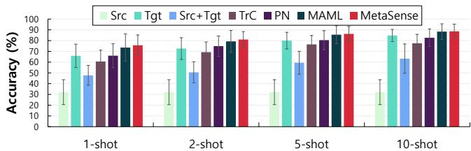  
Figure 7: Accuracy of the activity recognition dataset with ECDF features and CNNs $^ +$ LSTM models.

4.2.3 Down-sampled Activity Recognition. For our activity recognition dataset, we use a fixed-sized window length of 256 as mentioned in $\ S 4 . 1 . 1$ . Since different devices have different sampling rates, a fixed-sized window requires different duration of samples per device and this would worsen the condition problem. A possible solution would be down-sampling, at the expense of discarding samples that would be informative. To investigate to what extent down-sampling resolves the sampling rate dependency, we downsampled our dataset to the lowest sampling rate that our devices have $( 1 0 0 \mathrm { H z } )$ .

Figure 6 shows the accuracy of our down-sampled version of activity recognition dataset. The average accuracy across all methods is increased by around $5 \%$ compared to the non-downsampled dataset (Figure 5a). Although the accuracy of Src is increased by about $5 \%$ compared to the non-downsampled, it is still low (around $3 3 \%$ ), which means down-sampling does not completely solve the condition problem. Furthermore, down-sampling (and up-sampling as well) would require more complex considerations such as what should be the target sampling rate, given thousands of devices exist. MetaSense on the other hand, could even adapt to different sampling rates, demonstrating its adaptivity to unseen conditions without losing the samples.

4.2.4 Features and Models for Activity Recognition. We further investigate whether MetaSense works with recent features and models designed for activity recognition on mobile devices. We adopted the empirical cumulative density function (ECDF) [27], which is the state-of-the-art feature extraction for HAR [28, 30]. For the model, we utilized a combination of CNNs and LSTM networks that takes advantage of the effective feature learning of CNNs and the sequential modeling of LSTM [24, 31].

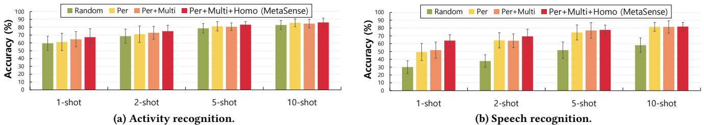  
Figure 8: Accuracy with and without our task generation strategies.

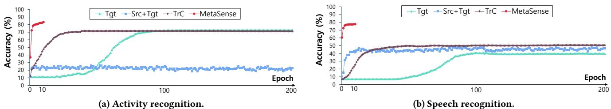  
Figure 9: Target accuracy changes over epochs.

Figure 7 shows the accuracy of CNNs $^ +$ LSTM models with ECDF features for our activity recognition dataset. The features and models specialized to HAR improve the overall accuracy. Nevertheless, MetaSense shows its effectiveness compared to the other baselines, especially when available data are few (i.e., 1-shot case). This showcases the model-agnostic characteristic of MetaSense; MetaSense applies to the features and models tailored to a specific sensing application.

# 4.3 Effect of Task Generation

We now examine the effectiveness of our task generation methods described in $\ S 3 . 2$ . We evaluate the accuracy of MetaSense while gradually adding each of our task generation method. As a baseline, we use random task generation from the source dataset, which is widely used in recent meta learning approaches [7, 15, 37, 43]. We implement the random task generation as described in $\ S 3 . 2$ . More specifically, tasks are generated from the instances sampled randomly from the source data regardless of conditions. We then use the same number of random tasks as the per-conditioned tasks. We use the activity and speech recognition datasets and report the accuracy for 1, 2, 5, and 10-shot cases.

Figure 8 reports the accuracy gain of our task generation methods. Random refers to the random task generation. The accuracy improvement escalates as each of our task generation strategies is added. The result shows that our per-condition (Per) and multiconditioned (Multi) tasks are effective than random sampling. This means those tasks can teach more plausible conditions to the base model than the randomly generated tasks. Furthermore, generating homogeneous tasks (Homo) helps to accumulate the common knowledge learned from the tasks that has the same label set $_ y$ that would improve the performance when faced with a target task that also has $_ y$ . In summary, the results demonstrate the importance of task generation algorithms to teach the base model, and our task generation methods effectively utilize the given source dataset $1 8 \%$ gap on average, $3 3 \%$ in the extreme case compared to Random) so that they catalyze the efficacy of meta learning for resolving the condition problem.

# 4.4 Adaptation Overhead

It is important to note that all the baselines and MetaSense requires different adaptation overhead. In this section, we demonstrate that MetaSense is also computationally efficient in the overhead of adaptation, i.e., the training time required to adapt to the target, which is crucial to ensure high quality mobile user experience. We inves tigate how many training epochs are required for each method to converge to its best performance (with respect to validation). In the experiments, we compare only Tgt, Src+Tgt, TrC, and MetaSense because Src and PN do not require the adaptation step while MAML has the same adaptation overhead as MetaSense. We report the accuracy averaged among 10 users in the 5-shot cases, where the overall trends for other shot cases are similar.

Figure 9 plots the accuracy changes for the target as training for adaptation proceeds. Note that while Tgt, TrC and MetaSense require only the target user’s data for adaptation, Src+Tgt trains with the entire data composed of the source and the target datasets. Therefore, each epoch of Src+Tgt requires about ten times more time than others with out datasets. For Tgt, TrC, and MetaSense, the required time for one epoch is the same. Both activity recognition (Figure 9a) and speech recognition (Figure 9b) show that MetaSense entails significantly less adaptation overhead compared to other approaches while achieving the highest accuracy. TrC requires fewer epochs to converge compared to Tgt as TrC already learned the representations through the source dataset and fine-tunes its parameters to the target via transfer learning. MetaSense maximally leverages the source data via meta learning so that it has the fastest convergence. As we use only ten gradient steps for adaptation as described in $\ S 4 . 1 . 3$ , MetaSense converges with only ten gradient steps. A different number of gradient steps could be used, e.g., more steps for achieving higher accuracy or fewer steps for minimizing the training overhead.

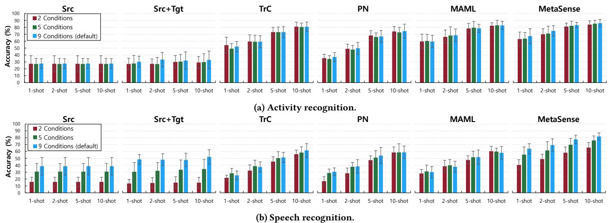  
Figure 10: Accuracy with a different number of ICDs.

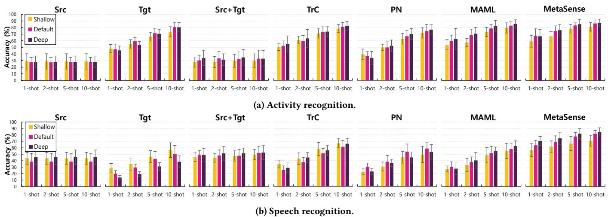  
Figure 11: Accuracy of different models.

# 4.5 Impact of Number of Conditions

Since MetaSense leverages the source dataset for generating tasks, the number of available data is important for building a good base model. The number of available ICDs, i.e., the number of individual conditions the source dataset has, affects the performance of MetaSense. We evaluate MetaSense by varying the number of ICDs from 2, 5 to 9 (9 is the default used in other experiments). We report the average accuracy of Src, Src $^ +$ Tgt, TrC, and MetaSense for 1, 2, 5, and 10-shot cases with our activity and speech recognition datasets. We omit Tgt as it only uses a few shots from the target, i.e., do not utilize the source dataset.

Figure 10 reports the average accuracy with a different number of ICDs (2 Conditions, 5 Conditions, and 9 Conditions). The overall trend is that as the number of available ICDs increases, the accuracy is also improved. Interestingly, the accuracy gain is more prominent in the speech recognition dataset. We think this is because our speech recognition task is more generalizable from the existing conditions than our activity recognition task, and hence the higher number of available conditions, the better the accuracy. Whereas in activity recognition where we believe the individual condition difference is more severe, the accuracy improvement is visible only in MetaSense. This shows that for the baselines, the quantity of the conditions does not ensure better accuracy due to the heterogeneity in the input distributions between individual conditions, while MetaSense can benefit from a larger amount of ICDs because of cleverly generated tasks and meta-learned knowledge from them.

# 4.6 Impact of Model Size

To evaluate whether the performance of MetaSense and other baselines are impacted by the size of the model, we vary the architectures. We test three models: (i) 5 convolutional layers $^ { + 3 }$ fullyconnected layers (Default), (ii) 3 convolutional layers $\textsuperscript { + 2 }$ fullyconnected layers (Shallow), and (iii) 7 convolutional layers $^ { + ~ 4 }$ fully-connected layers (Deep). We report the average accuracy of 1, 2, 5, and 10-shot cases.

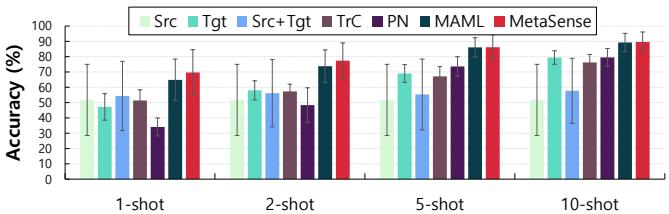  
Figure 12: Accuracy of the baselines and MetaSense on the HHAR dataset.

Figure 11 shows the accuracy of the different models for the activity and speech recognition datasets. In general, the deeper the model, the higher the accuracy, especially for MetaSense. Thanks to our regularization techniques in $\ S 4 . 1 . 3$ , the deeper models have more capacity to learn the representations for the target task, without being heavily overfitted to the training data. However, in the case of Tgt for speech recognition, our regularization does not help and the accuracy drops as the model size increases. This is due to overfitting since Tgt only uses a few shots from the target (DNN models typically, require a large amount of data to avoid overfitting). In MetaSense, the accuracy is monotonously improved as the size of the model increases. The results demonstrate that MetaSense’s outstanding performance over the baselines is not much sensitive to a certain size of the model.

# 4.7 Generalizability for Other Datasets

We use additional public datasets, Heterogeneity Human Activity Recognition (HHAR) [45] and Daily and Sports Activities (DSA) [2] datasets, to further generalize MetaSense’s performance. We use these two datasets as their data collection partly includes conditions.

4.7.1 HHAR. This dataset was collected with nine users for six human activities. Each user was equipped with eight smartphones around the waist and four smartwatches in the arms and logged accelerometer and gyroscope values for each activity. This dataset has user and device-model dependency but does not include various device positions as each mobile device is located at specific positions. We use the 256-length window with $5 0 \%$ overlapping between two consecutive windows [45]. After eliminating duplicate device models and conditions with less than 10 shots, we have six users and four different devices that result in a total of 24 conditions. We evaluate each 24 conditions with 15 $( 5 \times 3 )$ ICDs, ensuring no overlap in either the target device or the user. We report the average accuracy of the 24 conditions.

4.7.2 DSA. This dataset was collected with eight users for 19 daily and sports activities. Each user was equipped with the same five sensor units, with each unit composed of an accelerometer, a gyroscope, and a magnetometer, on five different positions: torso, right arm, left arm, right leg, and left leg. This dataset therefore has user and sensor-position dependencies. We use the 125-length window [2]. There are a total of 40 conditions, and similar to HHAR, we evaluate each of 40 conditions with 28 $( 7 \times 4 )$ exclusive ICDs. We report the average accuracy of the 40 conditions.

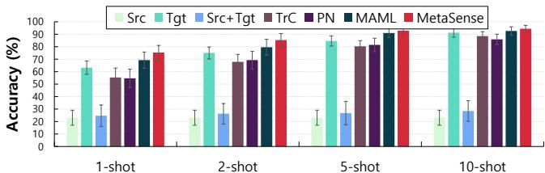  
Figure 13: Accuracy of the baselines and MetaSense on the DSA dataset.

4.7.3 Results. Figures 12 and 13 show the accuracy of the baselines and MetaSense with the HHAR and DSA datasets, respectively. The results indicate that the effectiveness of MetaSense generalizes to other datasets. The baselines show different trends between different datasets. As noted in our datasets earlier (§4.2.2), higher accuracy of Src and Src+Tgt in the HHAR dataset than in the DSA dataset means HHAR has more similar distributions among the conditions. On the other hand, Src and Src+Tgt perform poorly in the DSA dataset due to the severe differences between conditions. MetaSense nevertheless shows robust performance due to its flexibility in learning and adaptivity to new conditions.

# 5 RELATED WORK

We summarize prior approaches that tackle the challenge of diverse dependencies in mobile sensing. The issue of user and device depen dencies in mobile sensing has been brought to attention [45, 47, 51]. A study shows personalized models for HAR greatly outperform general models [51], which shows the impact of user dependency. Another study demonstrates different smart devices have different sensor biases, different sampling rates, and unstable sampling rates, which make it difficult to build a generalized model for different devices [45, 47].

To resolve these issues, there have been many proposals, which we categorize in the following sections. In summary, most existing studies are either limited to a particular dependency (e.g., sensor orientation or user) or to specific sensors and applications. On the contrary, MetaSense targets numerous individual conditions composed of various dependencies and is applicable to any deep neural models.

# 5.1 Sensor Calibration

Sensor calibration [8–10, 36, 38, 40, 41, 47, 52] is a direction for resolving the dependency problem. For instance, orientation-independent features are calculated from the accelerometer by summing the squared value of each x, y, and z sensor value [40, 41]. Some studies utilize additional sensors, e.g., magnetometers to convert the values into points in a global coordinate system to resolve different sensor orientations and positions [9, 36, 38, 47]. A recent approach attempts to resolve IMU sensor bias, scaling factor, and noise errors with machine learning [8]. However, these methods focus on a specific sensor type (e.g., IMU), a specific dependency (e.g., orientation) or a specific application (e.g., HAR), which require expertise on each domain and would not apply to other domains. MetaSense, on the other hand, takes a holistic approach and tackles multiple dependencies and domains. Nevertheless, previous approaches are

orthogonal to our solution and could be adopted to further improve the performance of MetaSense.

# 5.2 Synthetic Training

Another method to mitigate the dependency problem is to train with synthetic training examples generated from the source dataset [21, 53]. Mathur et al. [21] proposed building a deep model with synthetic data made of multiple devices to mitigate hardware/software heterogeneities of smart devices. However, this solution is focused only on the device dependency. CrossSense [53] proposed a roaming model for large-scale cross-site WiFi sensing. It leverages a large amount of source data for generating synthetic data that mimic unseen instances or users from the target site. However, it requires thousands of samples from the target site to train the roaming model, while MetaSense requires only a few shots.

# 5.3 Utilizing Unlabeled Target Data

Another line of research utilizes unlabeled data from a target condition [4, 6, 12, 13, 48]. This approach employs transfer learning (or domain adaptation); with labeled data from the source and unlabeled data from the target condition, it trains an adaptive model for the target condition. The advantage of this approach is that target users need not label their data. Although the approach does not require labeled target data, it needs a large amount of target data compared to our few-shot learning scheme. Furthermore, these approaches have been limited to specific individual conditions, e.g., changes of sensor positions on the body [4, 48] and changes of users with the same device [6]. It is uncertain whether such unsu pervised approach would be accurate under a complex combination of multiple dependencies where the input distribution is different from the source dataset; a study showed that the performance for HAR under individual conditions is only marginally improved or often dropped with the unlabeled target data [13].

# 6 DISCUSSION

We discuss the limitations of MetaSense and suggest future research.

# 6.1 Improving Accuracy

Although our evaluation showed that MetaSense outperforms the baselines, a higher accuracy (over $9 0 \%$ ) even with only 1 or 2-shots would be desirable. To achieve this ultimate goal, one could try more advanced model architectures that specialize in the target problem. For the current implementation of MetaSense, we did not excessively search the hyperparameter space. There might be better hyperparameters and model architectures that could improve the performance. Since we decouple our algorithm to the network architecture, we believe MetaSense could further improve the performance with different architectures for resolving individual conditions.

# 6.2 Long-term Behavior Changes

Our current design of MetaSense requires users to provide a few shots only at the initial adaptation step. After the adaptation, the model is adapted to the target user’s condition. However, user behaviors could change with time (e.g., walking slowly when one gets ill) and this could affect the model performance. To handle such a scenario, one can periodically adapt the model parameters for fast adaptation. Since the model is already adapted for that user at the initial step, the model would require even fewer data to adapt to the behavior changes. We remark that a recent meta learning scheme [1] that continuously adapts to non-stationary environments could be a promising direction to explore for adapting to long-term behavior changes.

# 6.3 Other Dependencies

We considered a typical practical scenario in mobile sensing where there exist different user behaviors and different devices (accordingly sensor positions and orientations). We realize in real deployments there could be other unexpected dependency problems such as environmental changes that we have not considered. However, our approach could be employed in other dependency problems. For instance, activity recognition with Wi-Fi signals faces the challenge of environment and user dependency [12, 53]. In situations where combinations of dependencies make input distributions significantly heterogeneous, we believe the insights and methods from MetaSense could be applied.

# 7 CONCLUSION

We investigated the problem of countless individual conditions in mobile sensing and how deep learning models perform under such situations. Inspired by the recent successes of meta learning in the machine learning community, we proposed MetaSense, a few-shot adaptation system that learns to learn for deep mobile sensing as a solution to this problem. MetaSense requires only a few shots from target users and thus entails minimal user effort. MetaSense leverages intelligently generated tasks and parameter updates via meta learning for resolving individual conditions in mobile sensing. In essence, MetaSense is model-agnostic, i.e., applicable to any deep learning models, and condition-agnostic, i.e., its coverage is not limited to a specific type of sensors and applications.

Our evaluation with multiple real-world datasets showed that MetaSense outperforms other approaches in both accuracy and adaptation time with only a few shots. Our experiments also demonstrated that the performance of MetaSense is not biased to certain model architectures and datasets. We believe MetaSense is a step towards mainstream adoption of mobile sensing for practical impact. The proposed meta learning approach and the insights from our study could be applied in innovative mobile sensing applications so that everyday users could deploy them without being limited by operating conditions.

# ACKNOWLEDGMENTS

This work was supported in part by Next-Generation Information Computing Development Program through the National Research Foundation of Korea (NRF) funded by the Ministry of Science and ICT (NRF-2017M3C4A7083534) and Institute for Information & Communications Technology Promotion (IITP) grant funded by the Korea government (MSIP) (No.B0717-16-0034, Versatile Network System Architecture for Multi-dimensional Diversity).

# REFERENCES

[1] Maruan Al-Shedivat, Trapit Bansal, Yuri Burda, Ilya Sutskever, Igor Mordatch, and Pieter Abbeel. 2018. Continuous Adaptation via Meta-Learning in Nonstationary and Competitive Environments. In International Conference on Learning Representations (ICLR).   
[2] Kerem Altun, Billur Barshan, and Orkun Tunçel. 2010. Comparative study on classifying human activities with miniature inertial and magnetic sensors. Pattern Recognition 43, 10 (2010), 3605–3620.   
[3] Jagmohan Chauhan, Jathushan Rajasegaran, Suranga Seneviratne, Archan Misra, Aruna Seneviratne, and Youngki Lee. 2018. Performance Characterization of Deep Learning Models for Breathing-based Authentication on Resource-Constrained Devices. Proceedings of the ACM on Interactive, Mobile, Wearable and Ubiquitous Technologies 2, 4 (2018), 158.   
[4] Yiqiang Chen, Jindong Wang, Meiyu Huang, and Han Yu. 2018. Crossposition Activity Recognition with Stratified Transfer Learning. arXiv preprint arXiv:1806.09776 (2018).   
[5] Qian Dai, Jiahui Hou, Panlong Yang, Xiangyang Li, Fei Wang, and Xumiao Zhang. 2017. The sound of silence: end-to-end sign language recognition using smartwatch. In Proceedings of the 23rd Annual International Conference on Mobile Computing and Networking. ACM, 462–464.   
[6] Ramin Fallahzadeh and Hassan Ghasemzadeh. 2017. Personalization without user interruption: Boosting activity recognition in new subjects using unlabeled data. In Proceedings of the 8th International Conference on Cyber-Physical Systems. ACM, 293–302.   
[7] Chelsea Finn, Pieter Abbeel, and Sergey Levine. 2017. Model-agnostic metalearning for fast adaptation of deep networks. In Proceedings of the 34th International Conference on Machine Learning-Volume 70. JMLR. org, 1126–1135.   
[8] Andreas Grammenos, Cecilia Mascolo, and Jon Crowcroft. 2018. You Are Sensing, but Are You Biased?: A User Unaided Sensor Calibration Approach for Mobile Sensing. Proceedings of the ACM on Interactive, Mobile, Wearable and Ubiquitous Technologies 2, 1 (2018), 11.   
[9] Fuqiang Gu, Allison Kealy, Kourosh Khoshelham, and Jianga Shang. 2015. Userindependent motion state recognition using smartphone sensors. Sensors 15, 12 (2015), 30636–30652.   
[10] Haodong Guo, Ling Chen, Gencai Chen, and Mingqi Lv. 2016. Smartphonebased activity recognition independent of device orientation and placement. International Journal of Communication Systems 29, 16 (2016), 2403–2415.   
[11] Gao Huang, Zhuang Liu, Laurens Van Der Maaten, and Kilian Q Weinberger. 2017. Densely connected convolutional networks. In Proceedings of the IEEE conference on computer vision and pattern recognition. 4700–4708.   
[12] Wenjun Jiang, Chenglin Miao, Fenglong Ma, Shuochao Yao, Yaqing Wang, Ye Yuan, Hongfei Xue, Chen Song, Xin Ma, Dimitrios Koutsonikolas, et al. 2018. Towards Environment Independent Device Free Human Activity Recognition. In Proceedings of the 24th Annual International Conference on Mobile Computing and Networking. ACM, 289–304.   
[13] Md Abdullah Hafiz KHAN, Nirmalya Roy, and Archan Misra. 2018. Scaling human activity recognition via deep learning-based domain adaptation. (2018).   
[14] Diederik P Kingma and Jimmy Ba. 2015. Adam: A method for stochastic optimization. International Conference for Learning Representations (ICLR) (2015).   
[15] Gregory Koch, Richard Zemel, and Ruslan Salakhutdinov. 2015. Siamese neural networks for one-shot image recognition. In ICML Deep Learning Workshop, Vol. 2.   
[16] Heli Koskimäki and Pekka Siirtola. 2016. Adaptive model fusion for wearable sensors based human activity recognition. In 2016 19th International Conference on Information Fusion (FUSION). IEEE, 1709–1713.   
[17] Alex Krizhevsky, Ilya Sutskever, and Geoffrey E Hinton. 2012. Imagenet classification with deep convolutional neural networks. In Advances in neural information processing systems. 1097–1105.   
[18] Nicholas D Lane, Petko Georgiev, and Lorena Qendro. 2015. DeepEar: robust smartphone audio sensing in unconstrained acoustic environments using deep learning. In Proceedings of the 2015 ACM International Joint Conference on Pervasive and Ubiquitous Computing. ACM, 283–294.   
[19] Gierad Laput, Karan Ahuja, Mayank Goel, and Chris Harrison. 2018. Ubicoustics: Plug-and-Play Acoustic Activity Recognition. In The 31st Annual ACM Symposium on User Interface Software and Technology. ACM, 213–224.   
[20] Jin Lu, Chao Shang, Chaoqun Yue, Reynaldo Morillo, Shweta Ware, Jayesh Kamath, Athanasios Bamis, Alexander Russell, Bing Wang, and Jinbo Bi. 2018. Joint modeling of heterogeneous sensing data for depression assessment via multi-task learning. Proceedings of the ACM on Interactive, Mobile, Wearable and Ubiquitous Technologies 2, 1 (2018), 21.   
[21] Akhil Mathur, Tianlin Zhang, Sourav Bhattacharya, Petar Veličković, Leonid Joffe, Nicholas D Lane, Fahim Kawsar, and Pietro Lió. 2018. Using deep data augmentation training to address software and hardware heterogeneities in wearable and smartphone sensing devices. In Proceedings of the 17th ACM/IEEE International Conference on Information Processing in Sensor Networks. IEEE Press,   
[22] Abhinav Mehrotra and Mirco Musolesi. 2018. Using Autoencoders to Automatically Extract Mobility Features for Predicting Depressive States. Proceedings of the ACM on Interactive, Mobile, Wearable and Ubiquitous Technologies 2, 3 (2018), 127.   
[23] Leo Mirani. 2015. There are now more than 24,000 different Android devices. https://qz.com/472767/there-are-now-more-than-24000-differentandroid-devices/   
[24] Francisco Javier Ordóñez Morales and Daniel Roggen. 2016. Deep convolutional feature transfer across mobile activity recognition domains, sensor modalities and locations. In Proceedings of the 2016 ACM International Symposium on Wearable Computers. ACM, 92–99.   
[25] Adam Paszke, Sam Gross, Soumith Chintala, Gregory Chanan, Edward Yang, Zachary DeVito, Zeming Lin, Alban Desmaison, Luca Antiga, and Adam Lerer. 2017. Automatic differentiation in PyTorch. In NIPS.   
[26] Valentin Radu, Catherine Tong, Sourav Bhattacharya, Nicholas D Lane, Cecilia Mascolo, Mahesh K Marina, and Fahim Kawsar. 2018. Multimodal deep learning for activity and context recognition. Proceedings of the ACM on Interactive, Mobile, Wearable and Ubiquitous Technologies 1, 4 (2018), 157.   
[27] Hammerla, Nils Y and Kirkham, Reuben and Andras, Peter and Ploetz, Thomas. 2013. On preserving statistical characteristics of accelerometry data using their empirical cumulative distribution. In Proceedings of the 2013 International Symposium on Wearable Computers. ACM, 65–68.   
[28] Kwon, Hyeokhyen and Abowd, Gregory D and Plötz, Thomas. 2018. Adding structural characteristics to distribution-based accelerometer representations for activity recognition using wearables. In Proceedings of the 2018 ACM International Symposium on Wearable Computers. ACM, 72–75.   
[29] Lake, Brenden M and Salakhutdinov, Ruslan and Tenenbaum, Joshua B. 2015. Human-level concept learning through probabilistic program induction. Science 350, 6266 (2015), 1332–1338.   
[30] Li, Hong and Abowd, Gregory D and Plötz, Thomas. 2018. On specialized window lengths and detector based human activity recognition. In Proceedings of the 2018 ACM International Symposium on Wearable Computers. ACM, 68–71.   
[31] Plötz, Thomas and Guan, Yu. 2018. Deep learning for human activity recognition in mobile computing. Computer 51, 5 (2018), 50–59.   
[32] Seyed Ali Rokni, Marjan Nourollahi, and Hassan Ghasemzadeh. 2018. Personalized Human Activity Recognition Using Convolutional Neural Networks. In Thirty-Second AAAI Conference on Artificial Intelligence.   
[33] Charissa Ann Ronao and Sung-Bae Cho. 2015. Deep convolutional neural networks for human activity recognition with smartphone sensors. In International Conference on Neural Information Processing. Springer, 46–53.   
[34] Charissa Ann Ronao and Sung-Bae Cho. 2016. Human activity recognition with smartphone sensors using deep learning neural networks. Expert systems with applications 59 (2016), 235–244.   
[35] Ramyar Saeedi, Skyler Norgaard, and Assefaw H Gebremedhin. 2017. A closedloop deep learning architecture for robust activity recognition using wearable sensors. In Big Data (Big Data), 2017 IEEE International Conference on. IEEE, 473–479.   
[36] Jayita Saha, Chandreyee Chowdhury, and Supama Biswas. 2017. Device independent activity monitoring using smart handhelds. In Cloud Computing, Data Science & Engineering-Confluence, 2017 7th International Conference on. IEEE, 406–411.   
[37] Adam Santoro, Sergey Bartunov, Matthew Botvinick, Daan Wierstra, and Timothy Lillicrap. 2016. Meta-learning with memory-augmented neural networks. In International conference on machine learning. 1842–1850.   
[38] Muhammad Shoaib, Stephan Bosch, Ozlem Incel, Hans Scholten, and Paul Havinga. 2015. A survey of online activity recognition using mobile phones. Sensors 15, 1 (2015), 2059–2085.   
[39] Pekka Siirtola, Heli Koskimäki, and Juha Röning. 2016. From user-independent to personal human activity recognition models using smartphone sensors. Proc ESANN’16 (2016), 471–476.   
[40] Pekka Siirtola and Juha Röning. 2012. Recognizing human activities userindependently on smartphones based on accelerometer data. IJIMAI 1, 5 (2012), 38–45.   
[41] Pekka Siirtola and Juha Röning. 2013. Ready-to-use activity recognition for smartphones. In Computational Intelligence and Data Mining (CIDM), 2013 IEEE Symposium on. IEEE, 59–64.   
[42] Pekka Siirtola and Juha Röning. 2016. Reducing Uncertainty in User-independent Activity Recognition-A Sensor Fusion-based Approach.. In ICPRAM. 611–619.   
[43] Jake Snell, Kevin Swersky, and Richard Zemel. 2017. Prototypical networks for few-shot learning. In Advances in Neural Information Processing Systems. 4077–4087.   
[44] Andrea Soro, Gino Brunner, Simon Tanner, and Roger Wattenhofer. 2019. Recognition and Repetition Counting for Complex Physical Exercises with Deep Learning. Sensors 19, 3 (2019), 714.   
[45] Allan Stisen, Henrik Blunck, Sourav Bhattacharya, Thor Siiger Prentow, Mikkel Baun Kjærgaard, Anind Dey, Tobias Sonne, and Mads Møller Jensen. 2015. Smart devices are different: Assessing and mitigatingmobile sensing hetgeneities for activity recognition. In Proceedings of the 13th ACM Conference on Embedded Networked Sensor Systems. ACM, 127–140.   
[46] Yaniv Taigman, Ming Yang, Marc’Aurelio Ranzato, and Lior Wolf. 2014. Deepface: Closing the gap to human-level performance in face verification. In Proceedings of the IEEE conference on computer vision and pattern recognition. 1701–1708.   
[47] Yunus Emre Ustev, Ozlem Durmaz Incel, and Cem Ersoy. 2013. User, device and orientation independent human activity recognition on mobile phones: Challenges and a proposal. In Proceedings of the 2013 ACM conference on Pervasive and ubiquitous computing adjunct publication. ACM, 1427–1436.   
[48] Jindong Wang, Vincent W Zheng, Yiqiang Chen, and Meiyu Huang. 2018. Deep transfer learning for cross-domain activity recognition. In Proceedings of the 3rd International Conference on Crowd Science and Engineering. ACM, 16.   
[49] Zhelong Wang, Donghui Wu, Raffaele Gravina, Giancarlo Fortino, Yongmei Jiang, and Kai Tang. 2017. Kernel fusion based extreme learning machine for cross-location activity recognition. Information Fusion 37 (2017), 1–9.   
[50] Pete Warden. 2018. Speech commands: A dataset for limited-vocabulary speech recognition. arXiv preprint arXiv:1804.03209 (2018).   
[51] Gary M Weiss and Jeffrey W Lockhart. 2012. The impact of personalization on smartphone-based activity recognition. In AAAI Workshop on Activity Context Representation: Techniques and Languages. 98–104.   
[52] Rong Yang and Baowei Wang. 2016. PACP: a position-independent activity recognition method using smartphone sensors. Information 7, 4 (2016), 72.   
[53] Jie Zhang, Zhanyong Tang, Meng Li, Dingyi Fang, Petteri Nurmi, and Zheng Wang. 2018. CrossSense: Towards Cross-Site and Large-Scale WiFi Sensing. In Proceedings of the 24th Annual International Conference on Mobile Computing and Networking. ACM, 305–320.   
[54] Bing Zhou, Jay Lohokare, Ruipeng Gao, and Fan Ye. 2018. EchoPrint: Two-factor Authentication using Acoustics and Vision on Smartphones. In Proceedings of the 24th Annual International Conference on Mobile Computing and Networking. ACM, 321–336.