# Boosting the Long Range Sensing Potential of LoRa

Binbin Xie, Minhao Cui, Deepak Ganesan, Xiangru Chen, Jie Xiong University of Massachusetts Amherst {binbinxie, minhaocui, dganesan, jxiong}@cs.umass.edu

# ABSTRACT

Wireless sensing is capable of capturing rich information of human target without requiring sensors attached to the target. Although promising, two critical issues still exist, i.e., (i) limited sensing range, and (ii) severe interference in real-world settings. Recently, LoRa is employed to improve the sensing range. Although LoRa sensing is able to achieve a longer sensing range than WiFi and acoustic sensing, it is still limited to tens of meters. In this paper, we propose ChirpSen, which fully exploits the property of chirp signal to increase the sensing range. ChirpSen adopts a chirp concentration scheme to concentrate the power of all signal samples in a LoRa chirp at one timestamp, improving the signal power and accordingly boosting the sensing range. With a longer sensing range, the interfer ence issue also becomes more severe. We propose a novel scheme to flexibly control the sensing coverage by tuning the LoRa chirp length in software. Real-world experiments show that ChirpSen is able to increase the detection range of a small size drone $( 1 2 \mathrm { c m } \times 1 0 \mathrm { c m }$ $\times 8 \mathrm { c m } )$ from $1 8 ~ \mathrm { m }$ to $1 6 0 \mathrm { ~ m ~ }$ . ChirpSen is capable of monitoring a human’s respiration rate at $1 3 8 \mathrm { m }$ and tracking a human target’s walking trajectory $2 1 0 \mathrm { m }$ away.

# CCS CONCEPTS

• Human-centered computing Ubiquitous and mobile computing systems and tools.

# KEYWORDS

chirp concentration, time-domain processing, long sensing range, interference mitigation, controlling sensing coverage

# ACM Reference Format:

Binbin Xie, Minhao Cui, Deepak Ganesan, Xiangru Chen, Jie Xiong. 2023. Boosting the Long Range Sensing Potential of LoRa. In The 21st Annual International Conference on Mobile Systems, Applications and Services (MobiSys ’23), June 18–22, 2023, Helsinki, Finland. ACM, New York, NY, USA, 14 pages. https://doi.org/10.1145/3581791.3596847

# 1 INTRODUCTION

Recent years have witnessed the emergence of wireless sensing as a promising way to capture information of human target ranging from coarse-grained daily activities [24, 37, 42, 59] to fine-grained vital signs [31, 35, 60]. Unlike traditional sensor-based approaches, wireless sensing does not require attaching sensors to human target, but utilizes wireless signals to capture the human context. The key principle is that wireless signal varies with human target movement and target movement information can be obtained by analyzing the signal variations.

While wireless sensing has achieved promising progress, it still faces one critical issue, i.e., limited sensing range. Different from wireless communication which leverages both direct path and reflection path for data transmission, wireless sensing only relies on reflection signals, resulting in a small sensing range. For example, the communication range of WiFi can be tens of meters but the sensing range is merely a few meters [54]. Very recent works exploit LoRa signals to increase the sensing range [48, 51, 55], and demonstrate a sensing range of $^ { 7 0 } \mathrm { m }$ for respiration monitoring by applying dedicated signal processing schemes. Although LoRa sensing has achieved a much longer range than other modalities such as WiFi and acoustic sensing, we find that the key property of LoRa chirp which enables LoRa to achieve a long communication range was actually not utilized in existing LoRa sensing systems.

In this paper, we propose a system named ChirpSen that takes fully advantage of the LoRa chirp property to increase the sensing range. Our proposed system is motivated by the design in LoRa communication which enables kilometer-level communication distance. The key idea behind this long communication range is that LoRa adopts chirp signal and utilizes chirp multiplication to concentrate power at a particular frequency as shown in Figure 1(a) [20, 36]. Specifically, LoRa modulates data via upchirp, and during the demodulation process, the received upchirp is multiplied with a predefined downchirp, concentrating the power of all signal samples at one fre quency. As LoRa communication leverages frequency information to demodulate data, the chirp multiplication operation can enable a long communication range.

So we ask this question: can we concentrate the power of the chirp signal in time domain for longer sensing range? In this paper, we adopt a chirp concentration scheme to concentrate signal power at one timestamp rather than at one frequency point. This operation is shown in Figure 1(b). The rationale of chirp concentration is to accumulate the power of all signal samples across one chirp at one timestamp, increasing the signal power and accordingly improving the sensing range.

However, one issue associated with long sensing range is that the interference issue becomes more severe because the interference range also becomes longer. From our experiments, we observe that an interferer even $3 0 ~ \mathrm { m }$ away from the target still interferes target sensing. Therefore, if the interference issue can not be properly addressed, the long-range sensing capability can hardly be utilized in real-world settings. To mitigate the interference issue, we propose to flexibly control the sensing coverage to only cover the target as shown in Figure 2. If the interferer is outside of the sensing coverage, the impact of interference is mitigated. Our key idea is to tune the chirp length to control the sensing range. This is because the longer the chirp, the more signal samples we have in the chirp. Therefore, a longer chirp can concentrate more power at one timestamp, leading to a longer sensing range. By tuning the chirp length in software, we can control the size of the sensing coverage in a fine-grained manner. A simple example (Case I) is shown in Figure 2(a) where the target is closer to the LoRa device. To mitigate the impact of interference, we employ a small chirp length to confine sensing in the blue area which only covers the target but not the interferer. A more challenging scenario (Case II) is that the interferer is closer to the LoRa device while the target is further away as shown in Figure 2(b). In this case, only controlling the size of sensing coverage does not work. To handle this challenging case, we propose to control the sensing coverage using two chirps of different lengths. Specifically, we use a longer chirp to cover both the interferer and target. This longer chirp enables us to obtain the mixed signal from both interferer and target. We further apply a shorter chirp to only cover the interferer and extract the signal from the interferer. By delicately subtracting the interferer’s signal from the mixed signal, we can obtain the clean target information. Note that we do not need to change the chirp length at the transmitter but just fine-tune the chirp length used for offline processing purely in software.

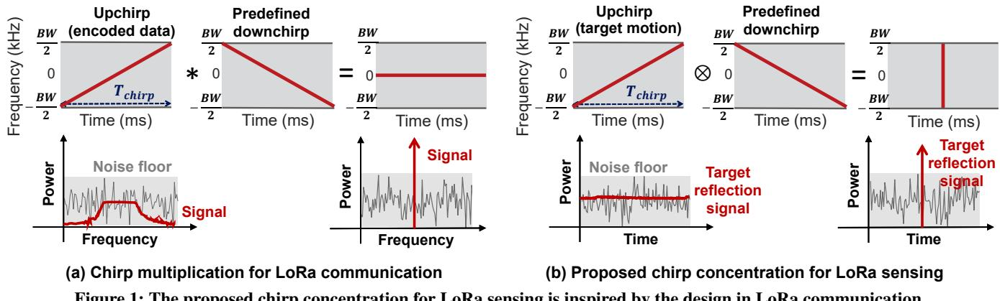  
Figure 1: The proposed chirp concentration for LoRa sensing is inspired by the design in LoRa communication.

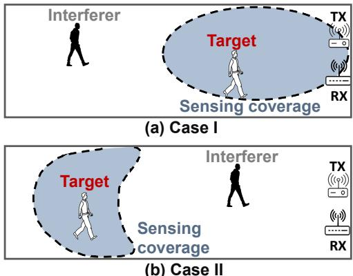  
Figure 2: Tuning sensing coverage to mitigate interference.

Contributions: The main contributions are summarized:

• To the best of our knowledge, we are the first to fully utilize the property of LoRa chirp for sensing. We adopt a chirp concentration scheme to significantly increase the LoRa sensing

range. The proposed scheme is general and can be applied to a large range of applications.   
• We propose signal processing schemes to flexibly control the sensing coverage to mitigate the interference issue in LoRa sensing, pushing LoRa sensing one step further towards reallife adoption.   
• We implement a prototype of ChirpSen and evaluate the system performance in both outdoor and indoor environments. For passive sensing, ChirpSen is capable of detecting a small drone with a size of $1 2 \mathrm { c m } \times 1 0 \mathrm { c m } \times 8 \mathrm { c }$ m in a contact-free manner at a distance of $1 6 0 \mathrm { m }$ . ChirpSen pushes the human walking sensing range from the state-of-the-art $1 1 3 \mathrm { m }$ to $2 1 0 \mathrm { m }$ . For respiration sensing, ChirpSen increases the sensing range from the state-of-the-art $7 2 ~ \mathrm { m }$ to $^ { 1 3 8 \mathrm { ~ m ~ } }$ . In indoor environment, human walking can still be accurately tracked even with multiple walls between the target and the LoRa device.

# 2 PRELIMINARIES

# 2.1 Key Design of LoRa Communication

In this section, we introduce the key design of LoRa communication which enables long-distance transmission via chirp-based modulation and demodulation.

Modulation. LoRa adopts Chirp Spreading Spectrum (CSS) modulation and the basic communication symbol is a linear upchirp [14, 26]. As shown in Figure 1(a), a LoRa upchirp sweeps linearly from frequency $- \frac { B W } { 2 }$ to $\textstyle { \frac { B W } { 2 } }$ over a time duration of $T _ { c h i r p }$ where ???? is the chirp bandwidth and $T _ { c h i r p }$ is the chirp length. When the distance between LoRa node (i.e., transmitter) and LoRa gateway (i.e., receiver) is large, the received upchirp can be below the noise floor with a low SNR (signal-to-noise ratio).

Demodulation. The received upchirp at the LoRa receiver is demodulated with a predefined downchirp whose frequency linearly decreases from $\textstyle { \frac { B W } { 2 } }$ to $- \frac { B W } { 2 }$ over the chirp duration $T _ { c h i r p }$ . 1 As shown in Figure 1(a), by multiplying the received upchirp and the predefined downchirp, we can convert the chirp sweeping across a frequency range to a single tone with all the signal samples having the same frequency. By applying Fast Fourier Transform (FFT) on the single-tone signal, the signal peak in frequency domain is significantly increased, which is utilized for decoding [20, 26, 36].

The chirp multiplication operation in LoRa demodulation is the key to achieving long-range communication under low SNR as it can concentrate the power of the entire chirp across a frequency range to a single tone (frequency) in the frequency domain. This design enables LoRa to detect weak signals even $2 0 \mathrm { d B }$ below noise floor.

# 2.2 Modelling LoRa Sensing

Suppose that one LoRa transmitter sends upchirp signals to one LoRa receiver. In general, the transmitted upchirp signal can be represented as

$$
S _ { T } ( t ) = e ^ { j ( 2 \pi f _ { s } t + \pi K t ^ { 2 } ) } ,
$$

where ???? is the starting frequency of the upchirp, and ?? = ????????ℎ?????? i the chirp slope [26]. The transmitted signal propagates via multiple signal paths before arriving at the LoRa gateway. The received signal can be represented as $S _ { R } ( t ) = S _ { T } ( t ) \cdot \Sigma _ { m = 1 } ^ { M } H _ { m }$ , where $M$ is the number of signal paths and $H _ { m }$ is channel of the ??th signal path. We group the signal paths into two categories, i.e., static path and dynamic path. The static path is composed of the line-of-sight (LoS) signal path and reflection signal path from static objects such as walls. The overall channel of the static paths is denoted as $H _ { s }$ . The dynamic path is reflected from the human target, which varies with time, and the channel of the dynamic path is represented as $H _ { d } ( t )$ . Therefore, the received signal at LoRa receiver can be denoted as

$$
S _ { R } ( t ) = \underbrace { e ^ { j ( 2 \pi f _ { s } t + \pi K t ^ { 2 } ) } } _ { \mathrm { c h i r p ~ p a r t } } \cdot [ H _ { s } + H _ { d } ( t ) ] .
$$

The key rationale behind LoRa sensing is that the received signal varies with target movement. The dynamic path channel $H _ { d } ( t )$ in Equation (2) contains the target movement information and can be used for target sensing.

As the chirp part does not contain the target information, previous LoRa sensing approaches cancel out this part by performing a signal ratio operation between the signals received at two adjacent antennas of the same receiver [48, 55]. In contrast, we keep this chirp part and utilize it to boost the sensing range.

# 3 BOOSTING SENSING RANGE

In this section, we introduce the proposed chirp concentration scheme, and also quantify its effect on increasing sensing range. Then, we compensate the carrier frequency offset (CFO) and sampling fre quency offset (SFO) due to non-synchronization between the LoRa transmitter and receiver.

# 3.1 Chirp Concentration

In this section, we illustrate why the chirp concentration operation can enable a longer sensing range.

Different from LoRa communication which utilizes the information in frequency domain to modulate and demodulate data, LoRa sensing employs time-domain signal variation to sense target movement [48, 55]. Inspired by the chirp multiplication operation in LoRa communication, we concentrate the power of all signal samples in one upchirp within the duration of $T _ { c h i r p }$ at one timestamp. As shown in Figure 1(b), we still employ a downchirp for signal processing with the received upchirp. However, instead of multiplication, we convolute the two chirps for sensing. Note that LoRa communication remains unaffected by the proposed LoRa sensing scheme. While the communication pipeline processes the received signal using chirp multiplication, the sensing pipeline processes the received signal using chirp convolution. These two processes are purely in software and can happen concurrently without interfering each other.

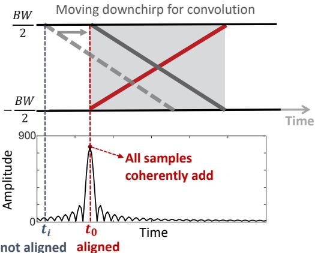  
Figure 3: Convoluting upchirp with downchirp.

The key rationale behind chirp concentration is that the downchirp is the time-reversed and conjugated version of the upchirp. The power of a signal is focused when it is convoluted with its timereversed and conjugated counterpart [25, 45]. To put it in the context of LoRa sensing, the received LoRa upchirp, when convoluted with the time-reversed and conjugated downchirp, has all the signal samples coherently added at one timestamp, creating a signal with a much higher power in time domain. This new signal after chirp concentration can be more easily detected. The new signal is then used for sensing to achieve a longer sensing range.

The process of chirp concentration via convoluting the received LoRa signal $S _ { R } ( t )$ with a predefined downchirp $S _ { d o w n } ( t )$ is illustrated below. As the received signal $S _ { R } ( t )$ is sampled by an Analog to-Digital Converter (ADC) into discrete samples $S _ { R } ( i )$ where $i$ is the sample index $1 \leq i \leq N$ , $N$ is the number of samples in one chirp), we have

$$
\begin{array} { r l } & { S _ { C } = S _ { R } ( i ) \otimes S _ { d o w n } ( i ) } \\ & { \quad \quad = [ S _ { u p } ( i ) \otimes S _ { d o w n } ( i ) ] \cdot [ H _ { s } + H _ { d } ] , } \end{array}
$$

where $S _ { C }$ is the signal after concentration, and $S _ { u p }$ represents the upchirp.2 Note that during the chirp period, we assume the dynamic signal $H _ { d }$ is a constant. As convolution is to sum up all the values after calculating the sample product of upchirp $S _ { u p } ( i )$ and reversed downchirp $S _ { d o w n } ( N + 1 - i )$ , Equation (3) can be rewritten as

$$
\begin{array} { l } { S _ { C } = \displaystyle \sum _ { i = 1 } ^ { N } \left[ S _ { u p } ( i ) \times S _ { d o w n } ( N + 1 - i ) \right] \cdot \left[ H _ { s } + H _ { d } \right] } \\ { \displaystyle \quad = \sum _ { i = 1 } ^ { N } \left[ S _ { u p } ( i ) \times S _ { u p } ^ { * } ( i ) \right] \cdot \left[ H _ { s } + H _ { d } \right] } \\ { \displaystyle \quad = \sum _ { i = 1 } ^ { N } | S _ { u p } ( i ) | ^ { 2 } \cdot \left[ H _ { s } + H _ { d } \right] } \\ { \displaystyle \quad = N \cdot C \cdot \left[ H _ { s } + H _ { d } \right] . } \end{array}
$$

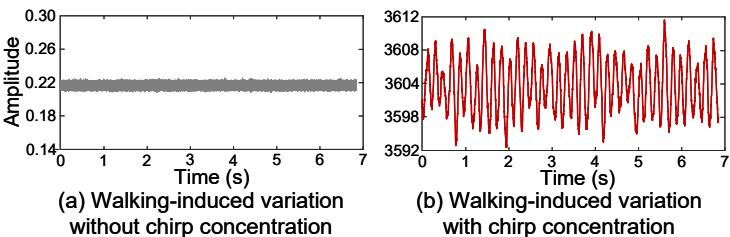  
Figure 4: Effect of chirp concentration to enlarge the walkinginduced amplitude variation.

In this equation, the reversed downchirp ?????????? (?? +1−??) is the same as the conjugated upchirp ??∗???? (??). The product of $S _ { u p }$ and $S _ { u p } ^ { * }$ equals to a real value $| S _ { u p } | ^ { 2 }$ . The value $\vert S _ { u p } \vert ^ { 2 }$ does not change with sample index as the upchirp signal has the same power at all frequencies. So we define $| S _ { u p } | ^ { 2 } = C$ to further simplify the equation where $C$ is the signal power before chirp concentration.

As $N$ signal samples are coherently added, according to Equation (4), the signal power after chirp concentration is boosted by $N$ times ( $N$ is the number of signal samples in the chirp). Most impor tantly, the noise is incoherently added because it is not time-reversed and conjugated with the predefined downchirp. This explains why the property of chirp can be utilized to boost the power of target reflection signal for sensing.

In summary, the received signal is composed of upchirps, and each upchirp has $N$ samples. We convolute each upchirp with the predefined downchirp to coherently add up the $N$ signal samples and obtain a concentrated signal sample. The power of the concentrated signal is much larger and the concentrated signal is used for sensing.

A simple example of the chirp concentration process is shown in Figure 3. At time $t _ { 0 }$ , the upchirp and downchirp are aligned and the convolution operation leads to very high signal power. Figure 4 shows the walking-induced signal amplitude variation with and without applying chirp concentration. As shown in Figure 4(a), when the target walks at a distance of $1 0 0 \mathrm { m }$ from the LoRa device, the target reflection (i.e., dynamic signal) is buried in noise. Thus there is no walking-induced amplitude variation. In contrast, after the chirp concentration operation, the signal strength of target reflection is significantly boosted and the walking-induced signal amplitude variation is clear as shown in Figure 4(b). In Figure 4(b), one cycle of amplitude variation, i.e., peak to peak, corresponds to a path length change of one wavelength ( $3 3 \mathrm { \ c m }$ at the carrier frequency of $9 1 5 ~ \mathrm { M H z }$ ) [51, 55]. The walking distance of target is half the path length change. In the time window of $_ { 7 \mathrm { ~ s ~ } }$ , we can observe a total of 36 cycles and infer the walking distance of the human target, i.e., $\begin{array} { r } { 3 6 \times \frac { 0 . 3 3 m } { 2 } = 5 . 9 4 \mathrm { m } . } \end{array}$ . This measured distance matches the groundtruth $( 5 . 8 8 5 \mathrm { ~ m } )$ ) obtained from a Laser Distance Meter (Disto E7300).

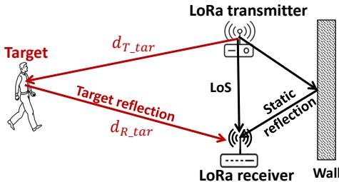  
Figure 5: Modelling LoRa sensing.

# 3.2 Quantifying Sensing Range Boosted by Chirp Concentration

In this section, we model the sensing range and quantify the improvement brought in by chirp concentration.

SSNR metric for LoRa sensing. In communication, SNR (signalto-noise ratio) is widely used to quantify the communication capability of a signal. In wireless sensing, only the dynamic signal reflected from the target contains the sensing information. Static signals such as the LoS signal and reflections from walls do not contain the target information. Therefore, we employ SSNR (sensing-signal-to-noise ratio) [44] to quantify the sensing capability of a signal as

$$
S S N R = \frac { P _ { d } } { P _ { n o i s e } } ,
$$

where $P _ { d }$ is the power of dynamic signal reflected from the target, and $P _ { n o i s e }$ denotes the power of noise.

Modelling sensing range. The sensing range (i.e., the maximum target-device distance) is determined by the minimum SSNR required for a particular application. Therefore, the sensing range is determined by both the noise power $P _ { n o i s e }$ and dynamic signal power $P _ { d }$ .

We now characterize the relationship between the dynamic signal power and sensing range. As shown in Figure 5, the dynamic signal path is divided into two parts. We denote the distance between the transmitter and target as $d _ { T \_ t a r }$ , and the distance between target and receiver as $d _ { R \_ t a r }$ . The power of dynamic signal after chirp concentration can be expressed as

$$
P _ { d } = \frac { P _ { T } G _ { T } G _ { R } \lambda ^ { 2 } \sigma } { ( 4 \pi ) ^ { 3 } ( d _ { T \_ t a r } \cdot d _ { R \_ t a r } ) ^ { 2 } } \cdot N ,
$$

where $P _ { T }$ is the transmission power, $G _ { T }$ and $G _ { R }$ are the antenna gains of the transmitter and receiver, $\lambda$ is the signal wavelength, and $\sigma$ is the radar cross section (RCS) of target.

We denote the sensing range as $d _ { t a r \_ m a x }$ , which is determined by the minimum dynamic signal power $P _ { d \_ m i n }$ that can enable sensing. As the LoRa transmitter and receiver are co-located, the two distances in Equation (6) are almost the same, i.e., ???? _?????? ≈ ????_?????? . In Equation (6), all the parameters can be considered as constants except $d _ { T _ { - } t a r } , d _ { R _ { - } t a r }$ and $N$ , thus we simplify the equation by representing all the constants as $C _ { s }$ . Then we can obtain the relationship between sensing range $d _ { t a r \_ m a x }$ and the power improvement $N$ after chirp concentration as

$$
d _ { t a r \_ m a x } = \sqrt [ 4 ] { \frac { C _ { s } } { P _ { d \_ m i n } } \cdot N } .
$$

Improvement on sensing range. According to Equation (7), the sensing range can be increased by $\sqrt [ 4 ] { N }$ times. Note that $\begin{array} { r } { N = T _ { c h i r p } . } \end{array}$ $F _ { s }$ where $T _ { c h i r p }$ is the chirp length (duration) and $F _ { s }$ is the sampling rate. The sampling rate of LoRa can be up to ${ 5 0 0 } \mathrm { k H z }$ . The largest standard LoRa chirp length is $3 2 . 8 \mathrm { m s }$ [28]. So theoretically, we can improve the sensing range by a maximum of $\sqrt [ 4 ] { 5 0 0 ~ k H z \times 3 2 . 8 ~ m s } =$ 11.3 times. We conduct experiments in the evaluation (Section 6) to explore how much improvement can be achieved in real scenarios.

# 3.3 Compensating for CFO and SFO

The received LoRa signals are known to contain time-varying phase offsets caused by CFO and SFO due to unsynchronization between LoRa transmitter and receiver [46]. These offsets, if not properly addressed, would cause the signal samples in the chirp to be added up incoherently, degrading the performance of chirp concentration. As presented in Figure 6, the chirp concentration with CFO and SFO removed achieves a much higher signal power than that with CFO and SFO.

Central Frequency Offset (CFO). The mismatched oscillator frequencies between transmitter and receiver result in CFO. The impact of frequency offset $\Delta f _ { c f o }$ caused by CFO is shown in Figure 7(a). The phase offset induced by CFO is represented as

$$
\phi _ { c f o } ( t ) = 2 \pi \Delta f _ { c f o } t + \phi _ { c \_ i n i } ,
$$

where $\phi _ { c \_ i n i }$ is the initial random phase offset. $\Delta f _ { c f o }$ induces continuous phase shift that accumulates over time, distorting the coherent addition in chirp concentration. On the other hand, $\phi _ { c \_ i n i }$ is constant and thus it does not interfere with the coherent addition in chirp concentration. Therefore, we only need to remove the frequency offset $\Delta f _ { c f o }$ .

Sampling Frequency Offset (SFO). The incoming signal is sampled by an Analog-to-Digital Converter (ADC) into discrete samples. The received signal is sampled at a slightly different sampling frequency $F _ { s } ^ { ' }$ instead of the sampling frequency $F _ { s }$ at the transmitter. As shown in Figure 7(b), a cumulative sampling offset has the effect of slowly moving the sample off the desired frequency value. The time offset $\Delta t _ { s f o }$ changes linearly over time, and the induced frequency offset is $\bar { \Delta } f _ { s f o } = K \cdot \Delta t _ { s f o }$ where $K$ is the chirp slope. The phase offset introduced by SFO can be represented as

$$
\phi _ { s f o } ( t ) = 2 \pi \Delta f _ { s f o } t + \phi _ { s \_ i n i } ,
$$

where $\phi _ { s \_ i n i }$ is a constant phase offset in a LoRa chirp. Similar to CFO, the SFO-induced frequency offset $\Delta f _ { s f o }$ distorts the coherent addition in the chirp concentration operation.

We remove the frequency offsets $\Delta f _ { c f o }$ and $\Delta f _ { s f o }$ by using the searching approach employed in NELoRa [26]. The basic idea is that the phase offsets induced by $\Delta f _ { c f o }$ and $\Delta f _ { s f o }$ can be modelled using the frequency bias $f _ { b }$ between the oscillators of LoRa transmitter and receiver. By searching the value of $f _ { b }$ in a specific range, we can measure and compensate for the offsets. Based on the datasheet of LoRa node SemTech SX1278, the value of frequency bias is in the range of [-50, 50] ppm. After the offsets are compensated, the power of concentrated signal is maximized.

# 4 DEALING WITH INTERFERENCE

In this section, we illustrate how the interference issue can be addressed. Our basic idea is to control the sensing coverage to only cover the area of interest, and the interferers outside of the coverage do not interfere with target sensing. In general, the interference issue can be grouped into two cases below:

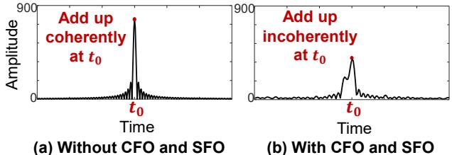  
Figure 6: CFO and SFO cause the signal samples to be added up incoherently.

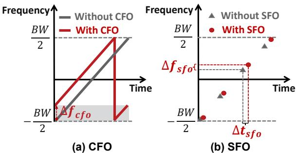  
Figure 7: Both CFO and SFO cause a frequency offset.

• Case I: the target is closer to LoRa device while the interferer is further away as shown in Figure 8.   
• Case II: the target is further from LoRa device than the interferer as shown in Figure 9.

Note that wireless sensing is usually separated from target localization. The area of interest and the target location are assumed to be known in wireless sensing applications. For example, in occupancy detection, the area of interest (e.g., a particular room or a particular apartment) is provided. In sleep monitoring, we are given the target (e.g., a baby) and the location (i.e., bed). To differentiate a target from other non-target subjects, usually the target can perform a signature gesture. For example, in gesture recognition, the target can wave the hand twice to let the wireless sensing system know he/she is the target. One advantage of the proposed method is that we do not need to know the exact locations of target and interferer for interference mitigation. As long as the target is within the area of interest, we can obtain the motion information. As long as the interferer is within the coverage of a particular chirp length, we can cancel out the effect of interference.

# 4.1 Controlling Size of Sensing Coverage

If the sensing coverage3 is large as shown in Figure 8(a), both the interferer and target can induce signal variations and they are mixed at the received signal. For this case, we propose to create a smaller sensing coverage as shown in Figure 8(b) to only cover the target. The interferer outside the sensing coverage does not interfere with target sensing anymore. In this section, we introduce how to control the size of sensing coverage to mitigate interference for Case I.

Quantifying sensing coverage. The sensing coverage is mainly determined by the power of dynamic signal reflected from the target.

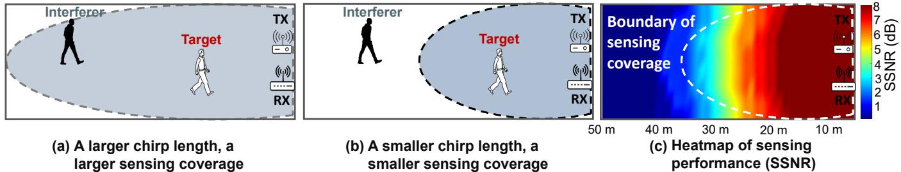  
Figure 8: Mitigating interference when target is closer to LoRa device (Case I).

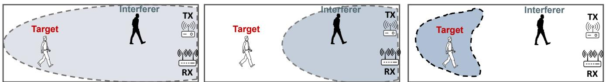  
pplying a larger chirp length (b) Step 2: applying a smaller chirp length (c) Step 3: subtracting interference signal Figure 9: Mitigating interference when interferer is closer to LoRa device (Case II).

In order to sense the target movement, the power of the dynamic signal has to be larger than a threshold. We quantify the sensing coverage using the SSNR metric dedicated for sensing. Figure 8(c) presents the heatmap of ${ \mathrm { S S N R } } ^ { 4 }$ for human walking sensing where red color means a good sensing performance while blue color indicates a poor sensing performance. The SSNR threshold varies for different applications. For human walking sensing, we empirically choose $\mathrm { S S N R } = 4$ dB as the threshold to determine the boundary of sensing coverage.

Tuning the size of sensing coverage. As illustrated in Section 3.2,√ chirp concentration can improve the sensing range by $\sqrt [ 4 ] { N }$ times where $N$ is the number of signal samples in the chirp. Note that $N =$ $T _ { c h i r p } \cdot F _ { s }$ where $T _ { c h i r p }$ is the chirp length and $F _ { s }$ is the sample rate. As the sampling rate $F _ { s }$ is a constant, the value of chirp length $T _ { c h i r p }$ is the key factor for tuning the sensing range, i.e., the size of sensing coverage. By tuning the value of chirp length ????ℎ?????? , we can control the size of sensing coverage in a fine-grained resolution. Based on LoRa standard, the chirp length is determined by two factors, i.e., the spreading factor5 (SF) and bandwidth (BW), where SF varies from 7 to 12 and BW can be $1 2 5 \mathrm { k H z }$ , $2 5 0 \mathrm { k H z }$ , and $5 0 0 \mathrm { k H z }$ [28]. Therefore, by varying the two configuration parameters, i.e., SF and BW, we can tune the chirp length. However, there are only 18 pairs of combinations of SF (6 values) and BW (3 values), leading to a small number of chirp lengths as well as a low resolution of tuning the chirp length. To address this problem, instead of controlling the chirp length at the transmitter side, we control it at the receiver side when we process the received chirp signal. Specifically, we transmit the longest chirp with a length of $3 2 . 8 ~ \mathrm { { m s } }$ by setting the chirp parameters as $\mathrm { S F } = 1 2 $ and $\mathrm { B W } = 1 2 5 ~ \mathrm { k H z }$ . At the receiver side, we only select part of the received chirp for the convolution operation. For example, if we want to decrease the chirp length to $3 . 1 5 ~ \mathrm { m s }$ , we only need to select part of the chirp which contains 1575 samples. Note that for a chirp with a length of $3 2 . 8 ~ \mathrm { { m s } }$ , we have a total of 16400 samples, where the sampling rate $F _ { s }$ is set as ${ 5 0 0 } \mathrm { k H z }$ .

Chirp length tuning resolution. The resolution of tuning the chirp length is $\frac { 1 } { F _ { s } }$ , i.e., the time interval between two adjacent signal samples. As $F _ { s }$ is big, we can control the size of sensing coverage in a fine-grained manner. Note that the resolution of tuning the size of sensing coverage is different from the resolution of distance estimation in radar systems. FMCW radar systems utilize chirp correlation to estimate the distance and also separate signals in time domain. The resolution is limited by the bandwidth. In our design, we neither estimate the absolute distance nor separate signals, but weaken the interferer’s impact on sensing.

# 4.2 Controlling Location of Sensing Coverage

Tuning the size of sensing coverage works when the target is closer to the LoRa device (Case I). The target can be located further from the devices than the interferer (Case II) as shown in Figure 9 which is more challenging. To deal with this challenging case, we apply a method that consists of three steps to remove the effect of interference. In Step 1, we apply a larger chirp length to cover both the interferer and target to obtain the mixed signal (Figure 9(a)). In Step 2, we employ a smaller chirp length to cover only the interferer and obtain the interferer’s reflection signal (Figure 9(b)). In Step 3, we subtract the interferer’s signal from the mixed signal (Figure 9(c)) to obtain clean target-induced signal variation for sensing. This method is purely in software, and does not require any hardware modification. It does not require any signal changes (e.g., varying the chirp length) at the transmitter side. The details are presented below.

Step 1: Applying a chirp with a larger length $T _ { c h i r p 1 }$ to cover both interferer and target. The chirp length $T _ { c h i r p 1 }$ is determined by the target location. The area of interest, i.e., the targeted sensing area, is given. For example, we would like to sense a target in a particular office room. We can represent the concentrated mixed

signal as

$$
S _ { C 1 } = S _ { s 1 } + S _ { d \_ i n t e r 1 } + \qquad S _ { d \_ t a r 1 , }
$$

desired signal for sensing

where $S _ { s 1 }$ is the concentrated static signal, $S _ { d \_ i n t e r 1 }$ and $S _ { d \_ t a r 1 }$ are the concentrated interferer reflection signal and target reflection signal, respectively.

Step 2: Applying a chirp with a smaller length $T _ { c h i r p 2 }$ to only cover the interferer. By using this chirp with a smaller length, we can obtain the signal which is only reflected from the interferer as

$$
S _ { C 2 } = S _ { s 2 } + S _ { d \_ i n t e r 2 } + n _ { t a r } ,
$$

where $S _ { s 2 }$ is the concentrated static signal and $S _ { d \_ i n t e r 2 }$ is the concentrated interferer reflection signal under the smaller chirp length. Note that although the target is not covered by this smaller coverage, it still induces subtle signal variations at the receiver. These subtle signal variations are too noisy to be used for sensing and we represent them as $n _ { t a r }$ .

Note that we create two different coverages in Figure 9 (a) and (b) using the same received data samples. We just vary the length of the chirp utilized to convolute with the received signal to change the sensing coverage. Therefore, in Figure 9 (a) and (b), the temporal states of the interferer are exactly the same and the interferers in Figure 9 (a) and (b) are exactly at the same location.

Step 3: Cancelling out interference. As the effect of interference exists in both Step 1 and Step 2, we can cancel it out by subtracting the interference signal from the mixed signal. However, this is not trivial as the interferer reflection signals in the two steps are concentrated differently using two different chirp lengths. That is to say, $S _ { d \_ i n t e r 1 }$ and $S _ { d \_ i n t e r 2 }$ in the previous two steps are different. Specifically, the interferer reflection signal in Step 1 is improved by $N _ { 1 }$ $\mathrm { ~ } _ { 1 } ( N _ { 1 } = T _ { c h i r p 1 } \cdot F _ { s } )$ times in power, while in Step 2, it is enhanced by $N _ { 2 }$ $( N _ { 2 } = T _ { c h i r p 2 } \cdot F _ { s } )$ times. To make $S _ { d \_ i n t e r 1 }$ and $S _ { d \_ i n t e r 2 }$ the same, we multiply the concentrated signal ????2 in Step 2 by ????ℎ??????1????ℎ??????2 . However, $n _ { t a r }$ in Equation (11) is also increased which can interfere with the target reflection signal $( S _ { d \_ t a r 1 } )$ we are interested in. To address this issue, we employ STFT (Short-time Fourier Transform) based denoising method [23] to remove $n _ { t a r }$ in $S _ { C 2 }$ before making the power of interferer reflections the same. The denoised concentrated signal can be expressed as $S _ { C 2 } ^ { ' } = S _ { s 2 } + S _ { d \_ i n t e r 2 }$ . Also, the sample rates of $S _ { d \_ i n t e r 1 }$ and $S _ { d \_ i n t e r 2 }$ are different. We downsample the denoised concentrated signal ${ \cal S } _ { C 2 } ^ { ' }$ so that the two interferer reflection signals have the same sample rate. Finally, we can derive the clean target reflection by signal subtraction

$$
\Delta S _ { s } + S _ { d \_ t a r 1 } = S _ { C 1 } - S _ { C 2 } ^ { ' } \cdot \frac { T _ { c h i r p 1 } } { T _ { c h i r p 2 } } ,
$$

where $\Delta S _ { s }$ is the residual static signal which does not affect sensing.   
$\Delta S _ { s } + S _ { d \_ t a r 1 }$ is then employed to sense target movement.

Dealing with the residual phase offsets. Since we leverage signal subtraction to cancel out the interference, not just accurate signal amplitudes are required, clean phase values are also expected. As illustrated in Section 3.3, we only remove the frequency offsets caused by CFO and SFO while the initial phase offsets are left and they vary across different LoRa chirps [46]. To deal with this issue, we utilize two antennas at the LoRa receiver as they share the same initial phase offsets. The phase offsets can be removed by calculating the phase difference.

Mobility of users. One advantage of our proposed method is that we can control the sensing area purely in software without a need of physically moving the sensing device to cover the mobile users. The sensing area is generally configured to be large enough (e.g., a room) to cover a mobile user. In a lot of real-world scenarios, the interferers do not move that much and stay within a particular area. For example, the target is in the bedroom and the interferer is in the living room. If the user moves out of the pre-defined sensing area, a larger chirp can be adopted to enlarge the sensing coverage.

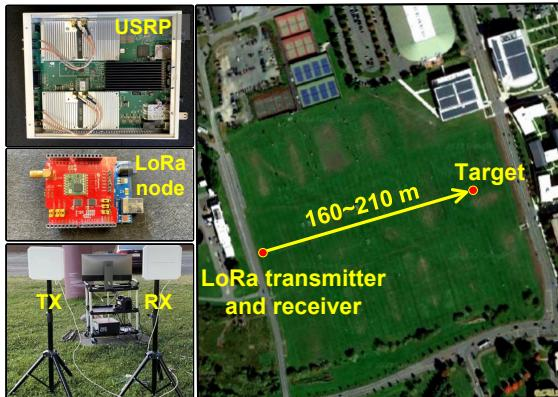  
Figure 10: Hardware and experiment setup in outdoor scenario.

# 5 IMPLEMENTATION

Now we introduce the implementation of ChirpSen including the frontend hardware and backend software.

Frontend hardware. We implement ChirpSen using a commodity LoRa node [5] as the transmitter and a USRP SDR (X310 with a TwinRX daughterboard) [10] as the receiver. Figure 10 shows the hardware equipment. The LoRa node is composed of Dragino LoRa shield embedded with a Semtech SX1276 module. We connect the LoRa shield to an Arduino Uno board to configure the SX1276 chip. The receiver collects LoRa signal samples at a sampling rate of ${ 5 0 0 } \mathrm { k H z }$ , and the captured signal samples are transferred to a laptop via an Ethernet cable for signal processing. The LoRa transmitter (node) is equipped with one antenna while the LoRa receiver (gateway) is equipped with two antennas. These antennas are directional antennas with an 8 dBi gain. We set the central frequency and transmission power as $9 1 5 \mathrm { M H z }$ and $2 0 \mathrm { d B m }$ , respectively. The transmitted LoRa chirp is configured with a spreading factor of 12 and a bandwidth of $1 2 5 \mathrm { k H z }$ , supporting a chirp length of $3 2 . 8 \mathrm { m s }$ .

Backend software. We collect LoRa signals using LABVIEW software and implement the proposed methods in MATLAB. The LABVIEW software provides us with an interface to integrate MATLAB functions [4] so that we can directly combine the data collection module and signal processing module. All the processing happens on a Dell OptiPlex 7050 tower desktop with an Intel Core i7 CPU and 16 GB RAM.

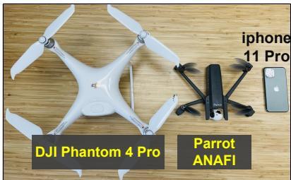  
Figure 11: Two different drones for drone detection experiments.

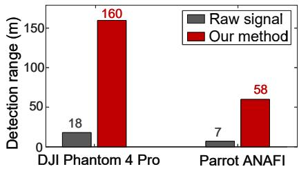  
Figure 12: Detection range for two drones.

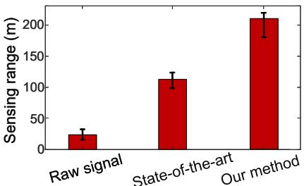  
Figure 13: Waking sensing range.

# 6 EVALUATION

In this section, we first evaluate the performance of sensing range for three applications, i.e., drone detection, walking sensing and respira tion monitoring in Section 6.1. We then evaluate the effectiveness of the proposed scheme in dealing with interference in Section 6.2.

# 6.1 Sensing Range

We demonstrate the capability of ChirpSen in increasing sensing range for drone detection, walking sensing and respiration sensing.

6.1.1 Drone detection. Drone is becoming increasingly popular in helping locate people in disasters, monitor traffic, and take images of areas that are difficult to physically visit. Unfortunately, not everyone has good intentions and drone detection becomes critical in a lot of scenarios to detect and prevent intrusions. Recent research works [33, 34] detect the presence of drone by monitoring the WiFi signals transmitted from a drone to its controller. However, they fail to detect an autonomous drone when there is no communication between the drone and controller [41]. Therefore, it is promising if we can transmit LoRa signals and utilize the reflection from the drone to detect it. Compared to other wireless sensing modalities such as WiFi sensing and acoustic sensing, LoRa sensing has the potential of detecting a drone much further away.

We conduct experiments in an outdoor field as shown in Figure 10 to explore the working range of our system in drone detection. We vary the distance between the drone and LoRa device from $5 \mathrm { m }$ to $1 7 0 \mathrm { m }$ . Two different drones, i.e., DJI Phantom 4 Pro with a size of $1 2 \mathrm { c m } \times 1 0 \mathrm { c m } \times 8 \mathrm { c m }$ [2] and Parrot ANAFI with a size of $1 7 \mathrm { c m } \times$ $4 . 5 \mathrm { c m } \times 4 \mathrm { c m }$ [7] are used in the experiments as shown in Figure 11. The Parrot ANAFI has a size similar to a smartphone. We define the detection range as the maximum distance when signal variations caused by drone movements can still be detected. The experiment results are shown in Figure 12. We can see that the detection range for DJI Phantom is increased from $1 8 \mathrm { m }$ to $1 6 0 \mathrm { m }$ by applying the proposed chirp concentration scheme. The Parrot ANAFI drone can be detected at a distance of $5 8 \mathrm { m }$ while the detection range is merely $7 ~ \mathrm { m }$ using the raw LoRa signal. The latency of drone detection is around $0 . 1 \ \mathrm { s } .$ . The long sensing range can be very meaningful in outdoor environment. Besides drone detection, we believe the proposed method can be applied to other outdoor applications such as disaster response and smart agriculture.

6.1.2 Human walking sensing. We now evaluate the sensing range of human walking. Note that we are capable of sensing the human’s walking distance rather than simply detecting whether the human target is walking or not.

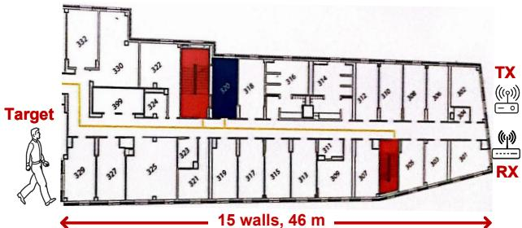  
Figure 14: Through-wall walking sensing.

Walking distance estimation. During the process of human walking, the dynamic signal rotates with respect to the static signal in the I-Q vector space, and the amount of rotation is related to the distance the target walks [55]. For example, when the target walks $1 \textrm { m }$ towards the LoRa device, the path length would be changed by roughly $2 \textrm { m }$ , inducing a rotation of $\frac { 2 m } { 3 3 c m } = 6 . 1$ cycles where $3 3 \mathrm { c m }$ is the signal wavelength for 915 MHz LoRa signal. A phase rotation of $3 6 0 ^ { \circ }$ can induce one cycle of sine-like variation on the amplitude of received signal. Therefore, the walking distance can be calculated by counting the number of sine-like variation cycles [55].

Sensing range. We first conduct experiments for human walking sensing in the outdoor environment (Figure 10). We vary the distance between the human target and LoRa device from $2 0 \mathrm { m }$ to $^ { 2 3 5 \mathrm { m } }$ a t a step size of $5 \mathrm { m }$ . The target walks for $1 { \sim } 3 \mathrm { m }$ . In each experiment, we obtain the walking-induced signal amplitude variation and estimate the walking distance by counting the number of variation cycles. We compare the estimated walking distance with the groundtruth. The groundtruth is obtained using a Laser Distance Meter (Disto E7300) with a millimeter-level accuracy. We choose a walking sensing error of $5 0 \mathrm { c m }$ as the threshold. We record the maximum distance when the sensing error is still less than $5 0 \mathrm { c m }$ as the sensing range. We conduct experiments 20 times to measure the average sensing range. As presented in Figure 13, the average sensing range with raw signal is around $^ { 2 3 } \mathrm { m }$ , while after applying our method, the sensing range is increased by 9.1 times to $2 1 0 \mathrm { m }$ . This range also outperforms the state-of-the-art sensing range, i.e., $1 1 3 \mathrm { ~ m ~ }$ [51], which is achieved through projecting the mixed signal to the optimal plane to amplify the signal phase variation.

Through-wall capability. We then evaluate the through-wall capability of ChirpSen for contact-free walking sensing in an indoor environment, i.e., a university dormitory as shown in Figure 14. The walls have a thickness between $9 . 6 \mathrm { c m }$ to $1 7 . 6 \mathrm { c m }$ . Our results show that when the target and LoRa device are separated by around $4 6 \mathrm { m }$ and with multiple walls in-between, the walking distance can still be accurately estimated.

6.1.3 Respiration monitoring. We also evaluate the performance of ChirpSen for contact-free respiration sensing.

Sensing range. We conduct experiments in an exterior hallway with a length of $1 8 0 \mathrm { m }$ . We vary the distance between the human target and LoRa device from $3 0 \mathrm { m }$ to $1 5 0 \mathrm { m }$ at a step size of $1 \mathrm { m }$ . The target breathes naturally. We capture the respiration-induced amplitude variation and calculate the respiration rate. We then measure the error by comparing the estimated respiration rate with groundtruth captured using a commodity device for respiration monitoring, i.e., HEXOSKIN GARMENTS [3]. The respiration rate error of $1 \mathrm { r p m }$ , which is the accuracy requirement for respiration monitoring, is chosen as the threshold to determine the maximum sensing range. As shown in Figure 15, the average sensing range using the raw signal is just $1 1 \textrm { m }$ , while after applying the proposed method, the average sensing range is increased to $1 3 8 \mathrm { m }$ . This range outperforms the state-of-the-art sensing range, i.e., $7 2 \mathrm { m }$ [51] which is achieved via projecting the mixed signal to the optimal plane to amplify the signal phase variation for sensing.

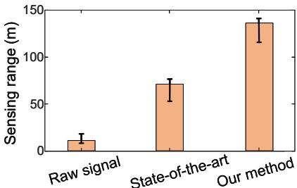  
Figure 15: Respiration sensing range.

Through-wall sensing capability. We then evaluate the throughwall capability for respiration sensing. The strong penetration capability of LoRa sensing can be utilized for survivor detection in disaster rescue search. Survivors trapped deep in the debris even in a coma can still be detected via respiration sensing. Our setup is similar to that of walking sensing. The experiment results show that ChirpSen is able to penetrate multiple walls and still accurately monitor the target’s respiration with a distance of $2 8 \mathrm { m }$ between the target and the LoRa device.

# 6.2 Dealing with Interference

In this section, we take walking sensing as the example to evaluate the performance of the proposed interference mitigation scheme.

6.2.1 Sensing range varies with chirp length. In the outdoor scenario, we measure the sensing range under different chirp lengths without interference. We vary the chirp length in $0 { \sim } 5 \ \mathrm { m s }$ , $1 0 { \sim } 1 5 ~ \mathrm { m s }$ , and $2 0 { \sim } 2 5 ~ \mathrm { m s }$ at a step size of $0 . 5 \mathrm { m s }$ . The experiment results are presented in Figure 16. We can observe that under a larger chirp length, a longer sensing range can be achieved. More interestingly, the increase of sensing range becomes slower when the chirp length becomes larger. Specifically, the sensing range is increased by $8 0 \mathrm { m }$ when the chirp length is changed from 0.1 ms to $5 \mathrm { m s }$ , while the sensing range is only increased by $1 1 \textrm { m }$ when the chirp length is changed from $2 0 \mathrm { m s }$ to $2 5 \mathrm { m s }$ . This is because the slope of sensing range increase, i.e., $\sqrt [ 4 ] { T _ { c h i r p } }$ is not a constant. Theoretically, we can achieve a resolution below $1 \textrm { m }$ on controlling the sensing range because we can tune the chirp length at a fine-grained step size of $\textstyle { \frac { 1 } { F _ { s } } }$ where $F _ { s } = 5 0 0 ~ \mathrm { k H z }$ is the sampling rate.

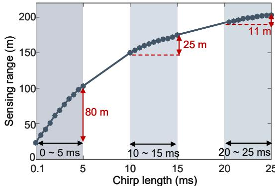  
Figure 16: Effect of chirp length on walking sensing range.

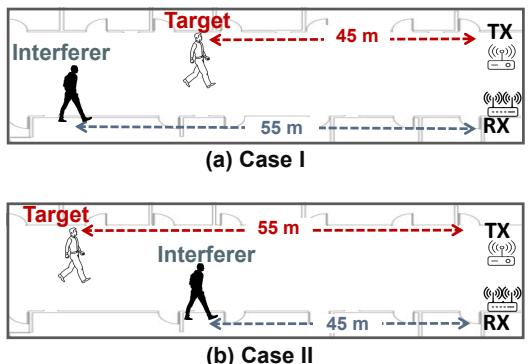  
Figure 17: Walking sensing with one interferer.

6.2.2 Walking sensing with one interferer. In this experiment, we evaluate the effectiveness of the proposed interference mitigation scheme. The distance between the LoRa transmitter and receiver is set as $1 \textrm { m }$ . We ask the target to walk $1 { \sim } 1 0 \mathrm { m }$ forward or backward with respect to the LoRa device, and estimate the corresponding walking distance.

Effect of controlling the size of sensing coverage. For Case I where the target is closer to LoRa device (Section 4.1), we control the size of sensing coverage to mitigate the impact of interference. As shown in Figure 17(a), the target-device distance is set as $4 5 \mathrm { m }$ while the interferer-device distance is $5 5 \mathrm { m }$ . The interferer can randomly change the moving direction and speed. We tune the chirp length from 1 ms to $1 . 8 \mathrm { m s }$ to control the size of sensing coverage. As shown in Figure 18(a), without applying the chirp concentration scheme, the amplitude of received signal is very small and does not show variations for the target and interferer movements. After applying the proposed chirp concentration scheme in Figure $1 8 ( \mathbf { b } ) { \sim } ( \mathbf { d } )$ , the obtained amplitude variations are much larger. We also observe that the performance varies with the chirp length. As shown in Figure 18(b), when the chirp length is $1 ~ \mathrm { m s }$ , it is too small and the corresponding sensing range does not cover the target, thus the amplitude variation can not be utilized for target sensing. When the chirp length is $1 . 4 ~ \mathrm { m s }$ , the sensing range just covers the target but not the interferer. In this case, the obtained signal variation is very close to the ground truth as shown in Figure 18(c). When the chirp length is further increased to $1 . 8 \mathrm { m s }$ as shown in Figure 18(d), both the target and interferer are located inside the sensing coverage. In this case, the interference is severe, leading to a large sensing error. These results demonstrate the effectiveness of tuning the chirp length to control the sensing coverage.

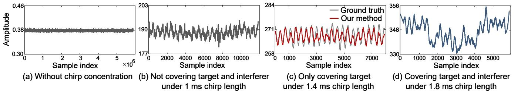  
Figure 18: Effect of controlling the size of sensing coverage.

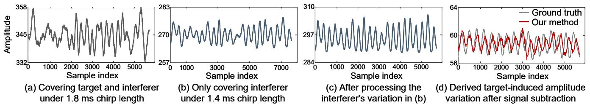  
Figure 19: Effect of controlling the location of sensing coverage.

Effect of controlling the location of sensing coverage. As shown in Figure 17(b), the target-device distance is around $5 5 \mathrm { m }$ while the interferer-device distance is around $4 5 \mathrm { m }$ . When we choose a chirp length of $1 . 8 ~ \mathrm { m s }$ to have a larger sensing coverage to cover both the target and interferer, the obtained signal amplitude variation is shown in Figure 19(a). With a smaller chirp length (i.e., $1 . 4 ~ \mathrm { m s }$ ), only the interferer is covered in the sensing coverage and the amplitude variation is shown in Figure 19(b). Before deriving the clean target’s amplitude variation, we need to denoise the interferer’s pat tern in Figure 19(b), and make it have the same signal power and sample rate as that in Figure 19(a). The interferer-induced amplitude variation after adjustment is shown in Figure 19(c). Finally, we can extract clean target-induced amplitude variation in Figure 19(d) after subtracting the interference.

# 6.2.3 Walking sensing with multiple interferers. In this exper iment, we evaluate the effectiveness of the proposed methods in dealing with multiple interferers.

We conduct experiments in three different environments. In the first scenario, the target is in an office and 19 interferers are located in a classroom next to the office as shown in Figure 20(a). In the classroom, the instructor walks around and 18 students sit on chairs. There are two concrete walls between the target and the LoRa device, and a glass wall between the target and the interferers. The second scenario in Figure 20(b) is an ${ 8 2 } \mathrm { m }$ long hallway with six interferers. Among these six interferers, four interferers are closer to the LoRa device than the target, while the other two interferers are further away from the device. Among the six interferers, four are walking and two are sitting. The initial distance between the target and LoRa device is around $5 2 \mathrm { m }$ . The third scenario is a $5 2 ~ \mathrm { m } \times 1 5 ~ \mathrm { m }$ library with eight interferers inside as shown in Figure 20(c). Two interferers are walking while the rest are sitting. In this scenario, the initial distance between the target and LoRa device is $4 1 \textrm { m }$ . In these scenarios, the sensing coverages are controlled to only cover the target and the coverage area is highlighted in light blue.

To quantify the effect of interference removal on walking sensing, we compare the performance with and without mitigating interference. We take Scenario 3 (i.e., library) as an example. As shown in Figure 21, before mitigating the impact of interference, the targetinduced amplitude variation is severely distorted by interference. After mitigating the impact of interference, the obtained amplitude variation pattern matches the ground truth. In each scenario, we conduct 15 experiments with varying walking distances. The target walking distances in the three scenarios are in the range of $1 { \sim } 4 . 4 \mathrm { ~ m ~ }$ , $1 { \sim } 1 7 \mathrm { ~ m ~ }$ , and $1 { \sim } 7 \mathrm { ~ m ~ }$ , respectively. The overall sensing performance for the three scenarios is shown in Figure 22. Without interference mitigation, the average error of walking distance estimation is $4 6 . 7 \mathrm { c m }$ , $1 0 4 . 4 \mathrm { c m }$ , and $1 7 3 . 2 \mathrm { c m }$ , respectively. After applying the proposed interference mitigation scheme, the average error is reduced to $1 0 . 4 \mathrm { c m }$ , $2 5 . 3 \mathrm { c m }$ , and $2 9 . 1 \mathrm { c m }$ , respectively. The overall cumulative distribution function (CDF) of walking distance estimation errors is shown in Figure 23. The median error without interference mitigation is $1 0 4 . 3 ~ \mathrm { c m }$ while the median error after applying our proposed method is $2 0 . 1 \mathrm { c m }$ .

6.2.4 Multi-target sensing. Multi-target sensing is a well-known challenge in contact-free wireless sensing. When multiple targets exist in the same environment, the reflection signals from multiple targets get mixed at the receiver and it is thus challenging to extract the information of each individual target. ChirpSen has the potential to sense multiple targets by fine-tuning the sensing coverage. As shown in Figure 24, we can control the sensing coverage to cover each target one by one. However, if two targets are very close to each other, it would be challenging.

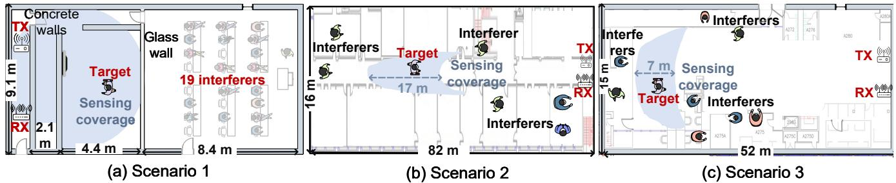  
Figure 20: Experiment setups in three scenarios.

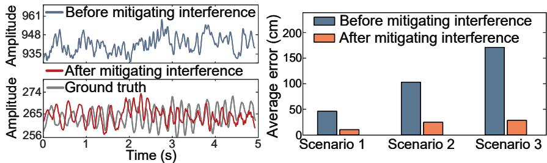  
Figure 21: The signal amplitude varia-Figure 22: Average errors of walking distions for Scenario 3. tance estimation for three scenarios.

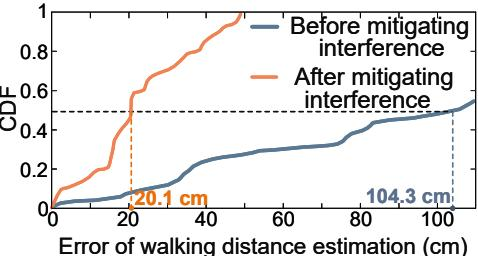  
Figure 23: Overall performance.

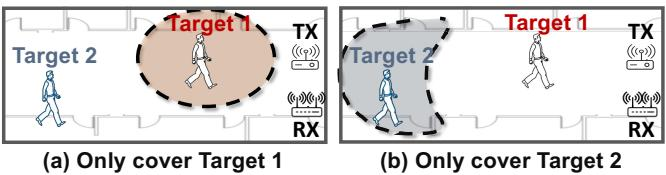  
Figure 24: Multi-target sensing.

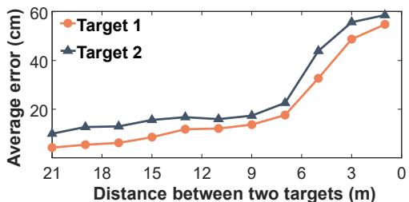  
Figure 25: Effect of distance between two targets.

We conduct experiments in the hallway of a university building to evaluate the performance of multi-target sensing under different distances between two targets. In the experiment, Target 1 is located around $1 0 \mathrm { m }$ from the LoRa device, and Target 2 is located further away. We change the location of Target 2 to decrease the distance between the two targets from $2 1 \textrm { m }$ to $1 \textrm { m }$ at a step size of $2 \textrm { m }$ . At each target-target distance, we estimate the walking distances, and compare them with the corresponding groundtruths obtained using a Laser Distance Meter (Disto E7300). The two targets walk for a distance of $3 \mathrm { m }$ . Figure 25 shows the average errors of walking distance estimation. We can observe that the error increases when the distance between two targets decreases. However, even for a small distance of $1 \textrm { m }$ , reasonably small errors of less than $6 0 \mathrm { c m }$ can still be achieved.

# 7 DISCUSSION

Sensing fast motions. While the proposed chirp concentration scheme increases the sensing range, it causes a lower sample rate. Therefore, there is a trade-off between sensing range and sensing fast motions. For fast motions, we need to adjust the chirp length to be smaller accordingly. To explore the maximum value of walking sensing range, we conduct experiments with a slow walking speed. We believe advanced signal processing schemes such as compressive sensing [52] and deep learning schemes such as generative adversarial network (GAN) can be applied to alleviate the need of high sample rate for sensing faster motions.

Severe interference issue. When the interferer is closer to the LoRa device and the target is very far away, the sensing performance degrades because the target-induced signal variation is too small and can be buried in the leakage during the interference cancellation process. We therefore suggest placing the device closer to the target in order to achieve reliable sensing. We envision that robots and drones can be used to carry the LoRa device to further extend the sensing coverage.

Controlling the direction of sensing coverage. To mitigate interference, we propose to smartly control the size of the sensing coverage. However, this does not work effectively when the interferer and target have similar distances but are located at different directions with respect to the LoRa device. In this case, we believe conventional beamforming technique can be used to tune the direction of sensing coverage and focus sensing at particular directions.

Factors affecting sensing range and accuracy. Besides interference, the chirp length and noise level also affect the sensing range. The sensing accuracy is further affected by the strength of signal reflected from the target which is dependent on the target-device dis tance and target property (e.g., target size, target surface smoothness and target material).

LoRa receiver. Our proposed method requires the LoRa receiver to report I/Q samples for signal processing. We adopt USRP for our current implementation. Our method can also work on cheap software defined radios such as RTL-SDR [9]. Based on our knowledge, the commodity LoRa receiver equipped with SX1301 chip [6] supports extracting I/Q samples.

# 8 RELATED WORK

In this section, we introduce the literature closely related to ChirpSen.

Chirp processing in radar and acoustic sensing. Chirp processing is widely applied for distance estimation in FMCW radar [11, 12] and acoustic sensing [27, 57]. FMCW radar and acoustic sensing systems utilize correlation to estimate the frequency offset between the transmitted signal and reflection signal. The frequency offset is then converted to absolute distance between the target and device. This operation usually requires a large frequency bandwidth. FMCW radars usually employ a frequency bandwidth on the scale of hundreds of megahertzs for tracking. However, for LoRa, the frequency bandwidth is too small (i.e., at most $0 . 5 \mathrm { M H z }$ ) and therefore this frequency offset method can not be applied for LoRa sensing. Instead, the signal amplitude and phase are utilized in this work for sensing. In addition, our proposed chirp concentration scheme is similar to pulse compression [8] which was designed for radar. ChirpSen explores the feasibility of using chirp concentration to boost the sensing range and mitigate interference in LoRa sensing.

LoRa communication. Last few years have witnessed significant progress in LoRa communication [26, 28, 53]. Most prior works utilize LoRa’s long-range communication capability for sensor data transmission [18, 19] and device localization [21, 22, 29, 30]. In contrast, ChirpSen leverages the LoRa signal itself as a sensing tool and employs the time-domain LoRa signal variations to sense target movements passively.

Long-range sensing. One fundamental limitation of wireless sensing is the small sensing range. To address this issue, several works propose to adopt LoRa signals for sensing recently [15, 48, 51, 55, 56]. Compared to other wireless signals such as WiFi [43, 54], RFID [49, 50], acoustic [27], UWB radar [58] and LTE [16], LoRa sensing can achieve a much longer range. Specifically, Zhang et al. [55] employ the signal ratio scheme to achieve a sensing range of $2 5 \mathrm { ~ m ~ }$ for respiration sensing, and use beamforming to realize multi-target respiration sensing [56]. Xie et al. [51] further improve the respiration sensing range to around $7 0 \textrm { m }$ . Other works integrate LoRa sensing with mobile platforms to increase the sensing coverage. WideSee [15] deploys the sensing device on a drone to move around the area of interest, and RobotSen [47] integrates the device with a moving robot for sensing. In comparison with these works, ChirpSen explores the unique property of LoRa chirp to significantly improve the sensing range via chirp processing. Moreover, ChirpSen can flexibly control the sensing coverage.

Interference mitigation in wireless sensing. To deal with in terference, the state-of-the-art approaches generally utilize a large antenna array or a large bandwidth, which can separate the target reflection signal from the interference signal in spatial domain or time domain. Unfortunately, these are not available on LoRa. The channel bandwidth for LoRa is at most $0 . 5 \mathrm { M H z }$ and there are usually only two antennas equipped at a LoRa gateway. Sen-fense [48] creates a virtual fence to confine sensing in the area of interest. However, the proposed method can only work for tiny movement such as respiration, but can not work effectively for large movements such as human walking. In contrast, the interference mitigation scheme proposed in ChirpSen can work for both small and large motions. Wang et al. [44] show that by physically placing the transmitter far from the receiver, the sensing coverage becomes smaller and the impact of interference can be mitigated. However, this method requires changing the physical location of the device. In contrast, ChirpSen can flexibly control the sensing coverage purely through signal processing in software.

RF-based drone detection. Nguyen et al. propose to detect the presence of drones hundreds of meters away by identifying the WiFi signal transmitted from a drone to its controller [32–34]. However, this method can not detect an autonomous drone when there is no communication between the drone and controller [41]. Previous works employ microphones [13] to capture the noise created by the propeller and camera [38] to sense the drone motion, but the sensing range is still limited. Recent works propose to transmit radio frequency signal and utilize the reflection from the drone to detect it [17, 40]. Compared to other RF signals such as WiFi [39], LoRa can achieve a much longer sensing range. Some commodity radars [1] can also achieve a relatively long range for drone detection. However, they are expensive (e.g., $\$ 40,000$ and employ large antenna arrays as well as high transmission power.

# 9 CONCLUSION

In this paper, we present the design, implementation, and evaluation of ChirpSen, a contact-free LoRa sensing scheme that leverages the unique property of LoRa chirp to significantly boost the sensing range. ChirpSen applies a chirp concentration scheme to focus the power of all signal samples across a chirp at one timestamp, significantly improving the power of received signal. Novel methods are designed to control the size and location of sensing coverage, mitigating the impact of interference which is a critical issue in long range sensing. We believe this is an important step towards real-life adoption of LoRa sensing.

# ACKNOWLEDGMENTS

This work was partially supported by the NSF under Grant CAREER2144668 and UMass Amherst Institute For Applied Life Sciences (IALS) Equipment Fund. Binbin Xie is supported by Google PhD Fellowship in Mobile Computing.

# REFERENCES

[1] Counter-drone radar. https://www.echodyne.com/ security/counter-drone-radar/.   
[2] Dji phantom 4 pro. dji.com/phantom-4-pro.   
[3] Hexoskin smart garments. https://www.hexoskin.com/.   
[4] Integrating matlab with labview. https://www.mathworks.com/products/connections/ product_detail/labview.html.   
[5] Lora shield. https://www.dragino.com/products/lora/ item/102-lora-shield.html.   
[6] Lora sx1301 chip. https://www.semtech.com/products/wireless-rf/loracore/sx1301.   
[7] Parrot anafi. https://www.parrot.com/us/drones/anafi.   
[8] Pulse compression. https://en.wikipedia.org/wiki/pulse_compression.   
[9] Rtl-sdr. https://www.rtl-sdr.com/buy-rtl-sdr-dvb-t-dongles/.   
[10] Usrp x310. https://www.ettus.com/all-products/x310-kit/.   
[11] F. Adib, Z. Kabelac, and D. Katabi. Multi-person localization via rf body reflections. In Symposium on Networked Systems Design and Implementation (NSDI), pages 279–292. USENIX, 2015.   
[12] F. Adib, Z. Kabelac, D. Katabi, and R. C. Miller. 3d tracking via body radio reflections. In 11th Symposium on Networked Systems Design and Implementation (NSDI), pages 317–329. USENIX, 2014.   
[13] M. Benyamin and G. H. Goldman. Acoustic detection and tracking of a class i uas with a small tetrahedral microphone array. Technical report, Army Research Lab Adelphi MD, 2014.   
[14] Z. Chang, F. Zhang, J. Xiong, J. Ma, B. Jin, and D. Zhang. Sensor-free soil moisture sensing using lora signals. ACM on Interactive, Mobile, Wearable and Ubiquitous Technologies (IMWUT), 6(2):1–27, 2022.   
[15] L. Chen, J. Xiong, X. Chen, S. I. Lee, K. Chen, D. Han, D. Fang, Z. Tang, and Z. Wang. Widesee: towards wide-area contactless wireless sensing. In Proceedings of the 17th Conference on Embedded Networked Sensor Systems (SenSys), pages 258–270. ACM, 2019.   
[16] Y. Feng, Y. Xie, D. Ganesan, and J. Xiong. Lte-based pervasive sensing across indoor and outdoor. In Proceedings of the 19th ACM Conference on Embedded Networked Sensor Systems (SenSys), pages 138–151. ACM, 2021.   
[17] A. Herschfelt, C. R. Birtcher, R. M. Gutierrez, Y. Rong, H. Yu, C. A. Balanis, and D. W. Bliss. Consumer-grade drone radar cross-section and micro-doppler phenomenology. In Radar Conference (RadarConf), pages 0981–0985. IEEE, 2017.   
[18] T. Hossain, M. A. R. Ahad, T. Tazin, and S. Inoue. Activity recognition by using lorawan sensor. In ACM on Interactive, Mobile, Wearable and Ubiquitous Technologies (IMWUT), pages 58–61. ACM, 2018.   
[19] T. Hossain, Y. Doi, T. Tazin, M. A. R. Ahad, and S. Inoue. Study of lorawan technology for activity recognition. In ACM on Interactive, Mobile, Wearable and Ubiquitous Technologies (IMWUT), pages 1449–1453. ACM, 2018.   
[20] N. Hou, X. Xia, and Y. Zheng. Don’t miss weak packets: Boosting lora reception with antenna diversities. ACM Transactions on Sensor Networks (TOSN), 2022.   
[21] K. Hu, C. Gu, and J. Chen. Ltrack: A lora-based indoor tracking system for mobile robots. IEEE Transactions on Vehicular Technology, 71(4):4264–4276, 2022.   
[22] B. Islam, M. T. Islam, and S. Nirjon. Feasibility of lora for indoor localization. on-line, from semanticscholar. org, pages 1–11, 2017.   
[23] K. Ito and M. Enoki. Real-time denoising of ae signals by short time fourier transform and wavelet transform. In International Conference on Acoustic Emission, pages 94–99, 2007.   
[24] W. Jiang, H. Xue, C. Miao, S. Wang, S. Lin, C. Tian, S. Murali, H. Hu, Z. Sun, and L. Su. Towards 3d human pose construction using wifi. In Proceedings of the 26th Annual International Conference on Mobile Computing and Networking (MobiCom), pages 1–14. ACM, 2020.   
[25] G. Lerosey, J. De Rosny, A. Tourin, and M. Fink. Focusing beyond the diffraction limit with far-field time reversal. Science, 315(5815):1120–1122, 2007.   
[26] C. Li, H. Guo, S. Tong, X. Zeng, Z. Cao, M. Zhang, Q. Yan, L. Xiao, J. Wang, and Y. Liu. Nelora: Towards ultra-low snr lora communication with neural-enhanced demodulation. In Proceedings of the 19th Conference on Embedded Networked Sensor Systems (SenSys), pages 56–68. ACM, 2021.   
[27] D. Li, S. Cao, S. I. Lee, and J. Xiong. Experience: practical problems for acoustic sensing. In Proceedings of the 28th Annual International Conference on Mobile Computing and Networking (MobiCom), pages 381–390. ACM, 2022.   
[28] J. C. Liando, A. Gamage, A. W. Tengourtius, and M. Li. Known and unknown facts of lora: Experiences from a large-scale measurement study. ACM Transactions on Sensor Networks, 15(2):1–35, 2019.   
[29] Y. Lin, W. Dong, Y. Gao, and T. Gu. Sateloc: A virtual fingerprinting approach to outdoor lora localization using satellite images. ACM Transactions on Sensor Networks (TOSN), 17(4):1–28, 2021.   
[30] J. Liu, J. Gao, S. Jha, and W. Hu. Seirios: leveraging multiple channels for lorawan indoor and outdoor localization. In Proceedings of the 27th Annual International Conference on Mobile Computing and Networking (MobiCom), pages 656–669. ACM, 2021.   
[31] J. Liu, Y. Wang, Y. Chen, J. Yang, X. Chen, and J. Cheng. Tracking vital signs during sleep leveraging off-the-shelf wifi. In Proceedings of the 16th ACM International Symposium on Mobile Ad Hoc Networking and Computing (MobiHoc), pages 267–276. ACM, 2015.   
[32] P. Nguyen, V. Kakaraparthi, N. Bui, N. Umamahesh, N. Pham, H. Truong, Y. Guddeti, D. Bharadia, R. Han, E. Frew, et al. Dronescale: drone load estimation via remote passive rf sensing. In Proceedings of the 18th ACM Conference on Embedded Networked Sensor Systems (SenSys), pages 326–339. ACM, 2020.   
[33] P. Nguyen, T. Kim, J. Miao, D. Hesselius, E. Kenneally, D. Massey, E. Frew, R. Han, and T. Vu. Towards rf-based localization of a drone and its controller. In Workshop on Micro Aerial Vehicle Networks, Systems, and Applications (DroNet), pages 21–26. ACM, 2019.   
[34] P. Nguyen, H. Truong, M. Ravindranathan, A. Nguyen, R. Han, and T. Vu. Matthan: Drone presence detection by identifying physical signatures in the drone’s rf communication. In Proceedings of the 15th Annual International Conference on Mobile Systems, Applications, and Services (MobiSys), pages 211–224. ACM, 2017.   
[35] K. Niu, F. Zhang, J. Xiong, X. Li, E. Yi, and D. Zhang. Boosting fine-grained activity sensing by embracing wireless multipath effects. In Proceedings of the 14th International Conference on emerging Networking EXperiments and Technologies (CONEXT), pages 139–151. ACM, 2018.   
[36] Y. Peng, L. Shangguan, Y. Hu, Y. Qian, X. Lin, X. Chen, D. Fang, and K. Jamieson. Plora: A passive long-range data network from ambient lora transmissions. In Proceedings of the 2018 Conference of the ACM Special Interest Group on Data Communication (SIGCOMM), pages 147–160. ACM, 2018.   
[37] Y. Ren, Z. Wang, S. Tan, Y. Chen, and J. Yang. Winect: 3d human pose tracking for free-form activity using commodity wifi. ACM on Interactive, Mobile, Wearable and Ubiquitous Technologies (IMWUT), 5(4):1–29, 2021.   
[38] C. Ruiz, S. Pan, A. Bannis, X. Chen, C. Joe-Wong, H. Y. Noh, and P. Zhang. Idrone: Robust drone identification through motion actuation feedback. ACM on Interactive, Mobile, Wearable and Ubiquitous Technologies (IMWUT), 2(2):1–22, 2018.   
[39] S. Rzewuski, K. Kulpa, B. Salski, P. Kopyt, K. Borowiec, M. Malanowski, and P. Samczynski. Drone rcs estimation using simple experimental measurement ´ in the wifi bands. In the 22nd International Microwave and Radar Conference (MIKON), pages 695–698. IEEE, 2018.   
[40] A. Schroder, M. Renker, U. Aulenbacher, A. Murk, U. Boniger, R. Oechslin, and P. Wellig. Numerical and experimental radar cross section analysis of the quadrocopter dji phantom 2. In 2015 IEEE Radar Conference, pages 463–468. IEEE, 2015.   
[41] S. Sciancalepore, O. A. Ibrahim, G. Oligeri, and R. Di Pietro. Pinch: An effective, efficient, and robust solution to drone detection via network traffic analysis. Computer Networks, 168:107044, 2020.   
[42] Y. Tian, G.-H. Lee, H. He, C.-Y. Hsu, and D. Katabi. Rf-based fall monitoring using convolutional neural networks. ACM on Interactive, Mobile, Wearable and Ubiquitous Technologies (IMWUT), 2(3):1–24, 2018.   
[43] J. Wang, H. Jiang, J. Xiong, K. Jamieson, X. Chen, D. Fang, and B. Xie. Lifs: low human-effort, device-free localization with fine-grained subcarrier information. In Proceedings of the 22nd Annual International Conference on Mobile Computing and Networking (MobiCom), pages 243–256. ACM, 2016.   
[44] X. Wang, K. Niu, J. Xiong, B. Qian, Z. Yao, T. Lou, and D. Zhang. Placement matters: Understanding the effects of device placement for wifi sensing. ACM on Interactive, Mobile, Wearable and Ubiquitous Technologies (IMWUT), 6(1):1–25, 2022.   
[45] C. Wu, F. Zhang, Y. Fan, and K. R. Liu. Rf-based inertial measurement. In Proceedings of the 2019 ACM Special Interest Group on Data Communication (SIGCOMM), pages 117–129. 2019.   
[46] X. Xia, N. Hou, Y. Zheng, and T. Gu. Pcube: scaling lora concurrent transmissions with reception diversities. In Proceedings of the 27th Annual International Conference on Mobile Computing and Networking (MobiCom), pages 670–683. ACM, 2021.   
[47] B. Xie, D. Ganesan, and J. Xiong. Embracing lora sensing with device mobility. In Proceedings of the 20th ACM Conference on Embedded Networked Sensor Systems (SenSys), pages 349–361. ACM, 2022.   
[48] B. Xie and J. Xiong. Combating interference for long range lora sensing. In 18th ACM Conference on Embedded Networked Sensor Systems (SenSys), pages 69–81. ACM, 2020.   
[49] B. Xie, J. Xiong, X. Chen, E. Chai, L. Li, Z. Tang, and D. Fang. Tagtag: material sensing with commodity rfid. In Proceedings of the 17th Conference on Embedded Networked Sensor Systems (SenSys), pages 338–350. ACM, 2019.   
[50] B. Xie, J. Xiong, X. Chen, and D. Fang. Exploring commodity rfid for contactless sub-millimeter vibration sensing. In Proceedings of the 18th Annual International Conference on Embedded Networked Sensor Systems (SenSys), pages 15–27. ACM, 2020.   
[51] B. Xie, Y. Yin, and J. Xiong. Pushing the limits of long range wireless sensing with lora. Proceedings of the ACM on Interactive, Mobile, Wearable and Ubiquitous Technologies (IMWUT), 5(3):1–21, 2021.   
[52] L. Yang, Y. Li, Q. Lin, X.-Y. Li, and Y. Liu. Making sense of mechanical vibration period with sub-millisecond accuracy using backscatter signals. In Proceedings of the 22nd Annual International Conference on Mobile Computing and Networking (MobiCom), pages 16–28. ACM, 2016.   
[53] F. Yu, X. Zheng, L. Liu, and H. Ma. Loradar: An efficient lora channel occupancy acquirer based on cross-channel scanning. In International Conference on Computer Communications (INFOCOM), pages 540–549. IEEE, 2022.   
[54] Y. Zeng, D. Wu, J. Xiong, E. Yi, R. Gao, and D. Zhang. Farsense: Pushing the range limit of wifi-based respiration sensing with csi ratio of two antennas. ACM on Interactive, Mobile, Wearable and Ubiquitous Technologies (IMWUT), 3(3):1–26, 2019.   
[55] F. Zhang, Z. Chang, K. Niu, J. Xiong, B. Jin, Q. Lv, and D. Zhang. Exploring lora for long-range through-wall sensing. ACM on Interactive, Mobile, Wearable and Ubiquitous Technologies (IMWUT), 4(2):1–27, 2020.   
[56] F. Zhang, Z. Chang, J. Xiong, R. Zheng, J. Ma, K. Niu, B. Jin, and D. Zhang. Unlocking the beamforming potential of lora for long-range multi-target respiration sensing. ACM on Interactive, Mobile, Wearable and Ubiquitous Technologies (IMWUT), 5(2):1–25, 2021.   
[57] F. Zhang, Z. Wang, B. Jin, J. Xiong, and D. Zhang. Your smart speaker can" hear" your heartbeat! ACM on Interactive, Mobile, Wearable and Ubiquitous Technologies (IMWUT), 4(4):1–24, 2020.   
[58] F. Zhang, J. Xiong, Z. Chang, J. Ma, and D. Zhang. Mobi2sense: empowering wireless sensing with mobility. In Proceedings of the 28th Annual International Conference on Mobile Computing And Networking (MobiCom), pages 268–281. ACM, 2022.   
[59] M. Zhao, T. Li, M. Abu Alsheikh, Y. Tian, H. Zhao, A. Torralba, and D. Katabi. Through-wall human pose estimation using radio signals. In IEEE/CVF International Conference on Computer Vision (CVPR), pages 7356–7365. IEEE/CVF, 2018.   
[60] M. Zhao, S. Yue, D. Katabi, T. S. Jaakkola, and M. T. Bianchi. Learning sleep stages from radio signals: A conditional adversarial architecture. In International Conference on Machine Learning (ICML), pages 4100–4109, 2017.